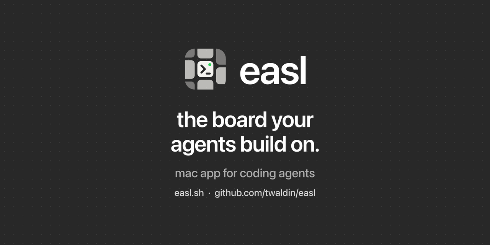

<a href="https://easl.sh"></a>

# the board your agents build on.

hold ⌃⌥⇧⌘ and click a box in a diagram, an element on a page or an item in a note, and your agent gets it with the next prompt. agents run in real terminals on one infinite board, beside your code, call graphs, a browser and html pages.

The diagram, the page and the note are each in another window. The answer scrolls away.


easl rendered this screenshot. A script laid out the tiles so they would fit the frame. Why I built easl, and a video of Claude Code explaining it on the board: [the launch post](https://tim.waldin.net/blog/2026-10-04-easl).

- **click what you mean into the next prompt.** Hold ⌃⌥⇧⌘ and click a shape, a DOM element, a note paragraph or list item, a line of code or a command's output. It becomes a chip in the tray, and your next prompt in that terminal carries it. For an agent without easl hooks, ⌃⌥⇧⌘V pastes it.
- **real terminals.** Your own `claude`, `codex` or any CLI, logged in as you, in a terminal libghostty draws with your Ghostty config. For Claude Code and Codex, a wrapper on the tile's PATH adds easl's hooks for that session only.
- **your code, with your language server.** Read-only code tiles of the whole file, with hover, go to definition, references and a git gutter against your branch. Call graphs of who calls what, computed by your language server (it needs call hierarchy; sourcekit-lsp is verified).
- **a browser your agents drive.** WebKit tiles. Claude Code, Codex and any CLI use `easl browser` (open, snapshot, click, type, eval, screenshot); omp uses its `browser` tool. The page's errors show on the tile.
- **notes, html pages and drawing.** Notes whose code excerpts follow the lines they quote, sandboxed HTML pages agents write, and shapes, arrows and ink from you or the agent.
- **agents keep running when you quit.** Terminals live in [zmx](https://github.com/neurosnap/zmx) sessions. Quit, crash or rebuild easl and they keep working.

**works with** Claude Code, Codex, opencode and Gemini CLI (before 0.60) with no setup, [omp](https://github.com/can1357/oh-my-pi) with one symlink, and any other CLI through ⌃⌥⇧⌘V.

A native Mac app for macOS 14 or later on Apple silicon, with no AI of its own. Free, MIT. Details on [easl.sh](https://easl.sh), in the [docs](https://easl.sh/docs/) and in the [guide](docs/guide.md).

## install

Requires macOS 14 or later on Apple silicon.

1. Quit easl if it's running, then run the installer. It downloads the latest release from [Releases](https://github.com/twaldin/easl/releases), checks its SHA-256 and moves `easl.app` to `/Applications` (`~/Applications` if that isn't writable), with no sudo ([read the script](https://easl.sh/install.txt)). curl sets no quarantine flag, so easl opens with no Gatekeeper prompt.
   ```sh
   curl -fsSL https://easl.sh/install | sh
   ```
2. Or download `easl-<version>.zip` from [Releases](https://github.com/twaldin/easl/releases), unzip it, and move `easl.app` to `/Applications`. It's ad-hoc signed, so Gatekeeper blocks the first launch. Clear the quarantine flag:
   ```sh
   xattr -dr com.apple.quarantine /Applications/easl.app
   ```
   Or open it once, then choose **Open Anyway** in System Settings › Privacy & Security. On macOS 14, right-clicking the app and choosing **Open** also works; macOS 15 removed that shortcut.
3. Install the runtime tools. Terminal tiles need zmx. The `easl` CLI and every agent integration need [bun](https://bun.sh).
   ```sh
   brew install neurosnap/tap/zmx oven-sh/bun/bun
   ```
   The Python SDK needs Python 3.11 or later; macOS's own `python3` is 3.9 (`brew install python` for a newer one).
4. Optional, for omp: link the easl extension. omp then reports its state, drives follow tiles, and gets the easl skill.
   ```sh
   mkdir -p ~/.omp/agent/extensions
   ln -sf /Applications/easl.app/Contents/Resources/extensions/omp/easl.ts ~/.omp/agent/extensions/easl.ts
   ```
5. Optional, for code navigation: install the language servers you want (sourcekit-lsp, pyright, typescript-language-server, gopls, rust-analyzer). Without one, Go to Definition, Find References and Outline answer by text search. [docs/install.md](docs/install.md#language-servers) has the install commands and how easl finds a server.

## first steps

1. Open easl. It opens a board on your home folder, with **Get Started** beside a practice note. Help › Get Started brings it back.
2. Hyper-click the practice note: hold ⌃⌥⇧⌘ and click a paragraph. A purple chip, the mention, appears in the tray at the bottom of the window. Without a Hyper key, select the note and press ⇧⌘M, or map Caps Lock to Hyper in [Karabiner-Elements](https://karabiner-elements.pqrs.org): Complex Modifications › Add predefined rule › "Change caps_lock to command+control+option+shift".
3. Press ⌘T for a terminal and run your agent: `claude`, `codex`, `opencode`, or `omp` with its extension (install step 4). Codex first asks whether to trust the folder.
4. Ask it something, like "what does this note say?". The chip goes with your prompt, and Get Started checks off both steps.
5. Open your project with File › Open Board… (⇧⌘O), open a file as a code tile with ⌘O, and Hyper-click a line of it.

## uninstall

End the terminal sessions first, or they keep running: `zmx list`, then `zmx kill <name>` for each `canvas-obj_…` session. Then delete `/Applications/easl.app` and the files easl writes, listed step by step in [docs/install.md](docs/install.md#uninstall). easl edits no shell, agent or Ghostty config.

## build from source

The Command Line Tools are enough; Xcode is not required. Client generation and the omp extension need [bun](https://bun.sh), and the Python SDK's tests need Python 3.11 or later.

```sh
swift build                    # debug build
scripts/bundle.sh release      # assemble .build/easl.app (ad-hoc signed)
swift run CanvasCoreTests      # test suite (an executable target; see Package.swift)
bun scripts/gen-clients.ts     # regenerate the Python/TS clients from schema/easl-api.json
```

`scripts/dev.sh` runs an isolated development instance. See [docs/testing.md](docs/testing.md).

## docs

- [docs/guide.md](docs/guide.md): every feature, from mentions to the agent API.
- [docs/install.md](docs/install.md): language-server lookup and the full uninstall.
- [docs/design.md](docs/design.md): the design record: principles, architecture and decisions.
- [docs/contracts.md](docs/contracts.md): the API, tile and scene contracts.
- [docs/testing.md](docs/testing.md): behavior tests and a development instance.
- [docs/releasing.md](docs/releasing.md): signing, notarizing and publishing a release.
- [skills/easl/SKILL.md](skills/easl/SKILL.md): how agents work on the board.

## support

Bugs and questions go in [GitHub issues](https://github.com/twaldin/easl/issues). To contribute, build and run the tests above and open a pull request. Report vulnerabilities privately, as [SECURITY.md](SECURITY.md) describes.

## license

MIT. See [LICENSE](LICENSE). easl builds on [Ghostty](https://ghostty.org), [tree-sitter](https://tree-sitter.github.io), [swift-markdown](https://github.com/swiftlang/swift-markdown) and [zmx](https://github.com/neurosnap/zmx); [THIRD_PARTY_NOTICES.md](THIRD_PARTY_NOTICES.md) lists every third-party component and its license, including GNU libintl's LGPL 2.1 terms.
