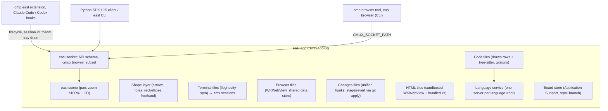

# easl — design record

A native macOS infinite board where coding agents run unmodified in real terminal tiles, next to browser, code/diff, note, and HTML tiles that both you and the agents can read, create, and change. The transcript stays in the agent's own terminal UI; the board holds the current working state.

## Principles

- **Terminal-first.** Agents (omp first) run their real TUI in a terminal tile. We never rebuild the agent's UI; every omp command, login flow, and question tool keeps working.
- **Own our protocols.** Depend only on public, intended interfaces: omp's extension API, AppKit/WebKit, libghostty-spm (pinned), the zmx CLI. Never impersonate another product. One sanctioned exception: the browser speaks a cmux-compatible socket subset so omp's native `browser` tool drives our tiles (revisit later).
- **Grounded, not decorative.** Code shown on the board comes from real files and real language-server answers. Authored content (notes, free-written snippets, HTML) is visibly styled as authored.
- **Cheap on a shared machine.** Lazy everything, bounded concurrency, detach what you can't see. Resource budget is a first-class requirement (see Performance).

## Architecture



`easld/` is the Go server the app will become a client of (docs/design/next.md). Today it is a separate binary that serves the same socket API from the same board files, and the app doesn't use it yet. Its packages follow CanvasCore, and the Swift code is the reference wherever behaviour is ambiguous:

- `model`: objects and mentions;
- `store`: board files, repository ids and worktrees;
- `board`: revisions, events, keys, groups, placement, layout, tray, lifecycle, attention, follow, opened web links and the activity log;
- `route` and `check`: arrow routing and layout.check, bit-identical to ConnectorRouter;
- `mention`: tray labels and the drain context;
- `measure`: code and image sizes;
- `weblink`: which text is an http(s) address and when two are the same page, read as Foundation's URL and URLComponents read them (percent-encoding, IDNA hosts);
- `router`: the methods;
- `server`: the socket framing;
- `swiftjson`: JSON as JSONEncoder writes it (numbers as Swift formats a Double), for board files, replies and events;
- `api`: generated from the schema by `scripts/gen-clients.ts`.

The conformance suite (docs/testing.md) is the judge. `go test ./cmd/easld` replays it against easld in-process.

easld and the app never share a home: easld takes the app's `instance.lock` on its `--home` and exits, naming the holder's pid, when it is held. It serves `--socket`, else `<home>/easl.sock` (never an inherited `EASL_SOCKET`, which every app terminal exports), and replaces only a stale socket file: a path that isn't a socket, or a socket another server answers on, is refused. Where the app's `try?` decode would start an unreadable board file empty and overwrite it, easld doesn't open it (`board.open` fails `unavailable`): one that doesn't decode, or is in a newer format than it reads. Keys it doesn't know, at the top level and on objects, are written back. A connection's request line may be 64 MiB, and reading pauses while 256 of its requests wait; every git it runs is stopped after 10 s unless the call sets its own limit, as requests are answered under one lock. SIGINT, SIGTERM and SIGHUP save the boards' pending changes before it exits.

easld does not yet measure what AppKit lays out, so object.measure and `size: "fit"` don't work for notes, text shapes, HTML or code captions. Notes are set in SF Pro, a system font that easld can't ship; text shapes use Shantell Sans, which needs GPOS kerning. Arrow label sizes, which feed `avoid` routing and label overlaps, are measured the same way and missing for the same reason.

## Decisions

### Interaction

| Input | Action |
| --- | --- |
| Click | Select to edit, move, drag |
| Right-click | Context menu |
| Shift-click | Add/remove from selection (a title bar, drawing or group label; inside a tile ⇧-click extends the tile's own text or line selection and selects just that tile) |
| Drag on empty board | Marquee select (box or lasso, a setting): the tiles and drawings it encloses, the groups whose whole region it encloses, and the arrows whose two ends are bound to what it selects (`SelectionScope.marquee`), wherever their route bends |
| Hyper-click (Caps Lock → ⌃⌥⇧⌘ via Karabiner) | Stage/unstage a mention; on a group's title or empty interior, the whole group (the innermost, named by its title: its members with their text and the arrows among them) |
| Hyper-drag on empty board | Marquee mention (one group mention); inside a group too, once the pointer moves 4 pt (less is a click on the group) |
| Hold Hyper | Outline what would be mentioned under the cursor (a group's whole region over its title or empty interior) |
| ⇧⌘M | Edit ▸ Mention: stage what the keyboard is on (a changes tile's hunk or lines, a code selection or range, a note's block, a page's selection, a terminal's selection or last command; else the selected tiles, or the selected group as a group mention; see Selection tray) |
| ⌘I | Edit ▸ Write Prompt: the composer takes the keyboard from anywhere, a terminal or page included (the board window takes ⌘I first; as Cursor's composer key: ⌘K is Ghostty's clear screen, ⌘L a browser tile's address field, ⌘P Go to); Return is a newline, ⌘↩ sends, Esc gives the keyboard back, ↑/↓ in an empty composer walk the board's sent prompts (see Composer) |
| ⌘G / double-click group | Named group; double-click enters it (zoom + dim the rest) |
| ⌘P | Go to… navigator (see Navigation) |
| ⌘= (⌘+) / ⌘- / ⌘0 / ⌘9 | Zoom in / zoom out, through browser-like levels (10, 15, 25, 33, 50, 67, 75, 90, 100%) / actual size (100%; with a selection, the selection at 100%) / zoom to fit |
| ⌃⌘= / ⌃⌘- / ⌃⌘0 | Zoom the content of the selected tiles (else the tile holding the keyboard) in / out / back to 100%, in place (see Size and zoom) |
| ⌥⌘←/→/↑/↓ | Step through the board like slides. ⌥⌘→ from the focused or selected object follows its outgoing arrow with `relation: "next_step"` and ⌥⌘← its incoming one (`StepOrder`: an authored order, whatever the layout; with several, the stop first in reading order); at the end of such a sequence a notice says "Last step" (or "First step") and nothing moves. ⌥⌘→ from a group holding such stops (an agent's walkthrough, often marked "Start here"; clicking that marker's edge pill selects it), or with nothing selected, starts a walkthrough at its first stop (the one no arrow steps to; with nothing selected, of the walkthrough nearest the view; `StepOrder.start`). Otherwise, and for ↑/↓: the nearest tile that way from the focused or selected tile (or the viewport center), preferring tiles in line with it (sharing at least a quarter of the narrower span across the heading: ↓ goes to the tile below, not to one beside it that reaches down; `Layout.neighbor`). The stop shows whole (`Layout.present`): nothing moves while it is in view with a margin; else it is centered at the current zoom, or fitted when larger than the view (never zoomed in), so the audience sees one stop rather than half of the last one beside a least pan; a walkthrough's stop stepped to from a view zoomed out below 50% (the ⌘9 overview) is fitted like Go to instead, up to 100% (`Layout.presentStop`), so each step reads like a slide; an agent's terminal counts with its follow tile when both fit at the current zoom (as Go to). A terminal takes focus, anything else is selected with the board holding the keyboard. Each step is a Back entry, and Back selects the stop it came from again, so ⌘[ walks back through the stops. The opposite arrow right after a geometric move goes back to the tile it came from, and a run of moves unwinds the same way (`TileWalk`) |
| ⌘W | Close the selected objects, else the focused terminal (terminals through the close sheet, which names what closing ends: the foreground program and the processes it or the shell started, e.g. "omp and 1 background process (pnpm exec next)" (`SessionProcesses`); Cancel is its default button, Return and Esc cancel, Close takes a click or ⌘⌫, which its button names: "Close  ⌘⌫"), then select the nearest tile left (`Layout.nearest`, the ⌥⌘-arrow ranking in every direction; a terminal takes the keyboard), so the next ⌘W closes that; with neither, the tab or window |
| ⌘F | Find in the focused or selected code tile: the bar gets a strip above the rows (never over a match); Esc gives the keyboard back to whoever had it |
| Return / Tab | With one tile selected and the board holding the keyboard: the tile takes it (a terminal; a code tile's rows: ↑/↓ or j/k a row, PageUp/PageDown or ⇧Space/Space a page, Home/End; a changes tile: j/k, ↩ open, s stage, r revert; a note: editing; a browser: the page, or the address field without one). Esc in the tile hands it back to the board with the tile still selected; in a terminal or a page Esc is the program's or the page's (a game pauses on it, a dialog closes), and ⌘Esc leaves (a note saves, like clicking away; with a conflict shown it keeps theirs, yours one ⌘Z away, see Notes; a page sees the Esc first, and it never also clears the selection). A terminal's Esc belongs to its program (vim, omp, zsh): ⌘Esc leaves it |
| ⌘Esc | View ▸ Leave Tile (also in the tile's context menu while it has the keyboard): the tile holding the keyboard, a terminal or page included, hands it to the board and stays selected. The board window takes it before the focused view, so no Ghostty keybind (`TerminalConfig.remaps`) or program can claim it; shells never see ⌘ |
| ⌘L | The address field of the focused or selected browser tile |
| ⌥⌘I | Safari's Web Inspector for the focused or selected browser tile's page, docked in the tile under its address bar; again closes it (View › Show/Hide Web Inspector; also the tile's and the page's context menus, Inspect Element) |
| ⌘R | Reload the focused or selected browser tile's page (View › Reload Page, as its reload button) |
| ⌘[ / ⌘] | Navigate Back / Forward (View ▸ Back, Forward; see Navigation). A browser page holding the keyboard goes back and forward itself, as in Safari |
| ⌘J | Go to Next Needs-You: blocked agents' terminals first, then tiles with attention markers, then done agents' terminals not seen yet (finished, waiting for review), on this board, each in reading order (`NeedsYouItem`), framed like Go to, selected (acknowledging a marker) and focused if a terminal (which sees a done agent); giving a tile the keyboard or typing in it acknowledges its marker too, so a marker about an agent's question clears as the user answers it in the terminal that already had the keyboard (round 8); again from there, the next, around. With nothing pending, a notice says "Nothing needs you" (`CanvasView.showNotice`) |

- A ⌃-chord pressed with the board holding the keyboard whose ⌘ twin is an easl shortcut (a PC habit: Ctrl+T, Ctrl+W, Ctrl+Z, Ctrl+=) shows a notice naming the Mac key and the command, "On a Mac this is ⌘T (New Terminal) · ⌘ is the Windows key on a PC keyboard", once per chord per session (`CanvasView.noticeMacKey`); the linux study's Ctrl shortcuts did nothing and said nothing. A terminal, page or text field holding the keyboard keeps ⌃ for its program and never sees the notice.
- Board navigation shortcuts (⌘P, ⌘9, ⌘0, ⌘= / ⌘+, ⌘-, ⌥⌘-arrows, ⌘W) work wherever keyboard focus is, including a terminal or web page: the window takes them before the focused view (Ghostty binds ⌘0/⌘=/⌘-/⌘9 to font size and tabs, ⌘W to close surface, ⌥⌘-arrows to go to split; a web view ⌘=/⌘- to page zoom; shells never see ⌘). In a focused terminal every other menu shortcut (⌘T, ⌘N, ⌘O, ⌘G, ⌘⇧[/], ⌘Q, Window › Show Next/Previous Tab ⌃⇥/⌃⇧⇥, ⌘Esc … named keys matched by name, `KeyChord(menuKey:)`) also beats Ghostty's bindings, which give ⌘T, ⌘N, ⌘Q and ⌘⇧[/] to tab, window and app actions the embedded library can't perform; Copy, Paste, Select All, ⌘⌫ (Ghostty's delete line) and ⌘Z / ⇧⌘Z stay with the terminal (Edit ▸ Undo and Redo are disabled while a terminal has the keyboard: ⌘Z in nvim silently undid a changes tile's Stage, vim study round 6). ⌘F goes to a code tile when one is focused or selected, else stays with the terminal or page.
- The keyboard is where the user is looking (`KeyboardFocus`): a plain press anywhere on a tile's title bar but its buttons (a click, the first click into an inactive window too, or the start of a drag; a press on its ✕ or content zoom control turns to the tile as well, `TileTitleBar`) gives a terminal the keyboard and leaves anything else's with the board (Return enters it), away from whatever tile had it, a terminal included; and whenever the selection changes by any path (marquee, a drawing or group label, Go to, ⌘J, ⌥⌘-arrows, a clicked marker) a tile other than a terminal keeps the keyboard only while it is the whole selection, so `s`, `r` and the arrows never act on a tile the ring has left. A terminal keeps it while the mouse presses drawings or draws, and when its ⌘-clicked reference selects a code tile (dictation pastes into it); a click on empty board gives the keyboard to the board. A click on a changes tile's line opens the code tile without selecting it: the changes tile keeps the ring and the keys.
- The keyboard always lands somewhere: going to a tile by keyboard (Go to, ⌥⌘-arrows, ⌘J, a new object the user asked for) focuses a terminal and otherwise leaves the keyboard with the board, so Delete, Esc, ⌘W and ⌘G act on the selection and Return enters the tile; closing the tile that had it hands it to the board too. Whatever borrows the keyboard (Go to, Outline, Find References, the find bar, the close sheet) gives it back to whoever had it when it closes, a terminal through its own focus path (`CanvasView.returnKeyboard`), so typing after Esc reaches the terminal.
- **Menu bar reaches everything**: every context-menu action is also in the main menu (the board's New … Here items are File ▸ New … at the view's centre), validated (disabled when it doesn't apply), so the keyboard, menu search (Help, ⌘?), Full Keyboard Access and VoiceOver reach them: File ▸ Review Changes (⇧⌘R) and Review Branch, for the checkout the focused or selected terminal works in, else the board's working worktree, else the board root (Review Branch on the default branch with nothing to go by offers the repository's worktrees); Object ▸ Enter Group, Content Zoom ▸ (Zoom Content In ⌃⌘=, Zoom Content Out ⌃⌘-, the presets, Reset Content Zoom ⌃⌘0; see Size and zoom), Follow Files (focused or selected terminal), Copy Object ID, Close Selection; Code ▸ Go to Definition (⌃⌘J), Open Definition in New Tile (⌃⌥⌘J), Find References (⌃⌘R), Outline (⌃⌘O) on the focused code tile, else the selected one, else the one last clicked (`KeyboardFocus.codeTarget`; with none, a notice at the bottom of the view says so, `CanvasView.showNotice`); View ▸ Go to Next Needs-You (⌘J), Back (⌘[), Forward (⌘]), Leave Tile (⌘Esc), Clear Attention Markers, Hide Board Chrome (⌥⌘T, as AppKit's Show/Hide Toolbar); Help ▸ easl Basics (⌥⌘/, beside menu search's ⌘?); Window (Minimize ⌘M, Zoom, the board tabs, Bring All to Front). New chords are ⌘ chords no shell sees and Ghostty binds nothing to (⌃⌘= is Ghostty's equalize splits, which has no splits here); never ⌥⌘= / ⌥⌘- / ⌥⌘8, macOS Zoom's, which the people who need bigger tiles use.
- **Accessibility**: each tile is an accessibility group labelled with its title and what tells it apart: an agent terminal's lifecycle ("omp · π > Fix it, done", "…, blocked: approve Bash?"), a code tile's lines and caption ("src/click/core.py, lines 1321–1331, Step 1/4 · …"), an image's caption, and "created by <terminal>" for an agent's object; with a role description (terminal, code, note, changes, browser, HTML); its close button is "Close <title>", and its zoomed-out or offscreen card image has the tile's label. While live, a code tile holds a read-only text area of its range's lines (else the lines in view, at most 1,000), each after its line number ("1321  def f():"), and a terminal one of its screen, read from Ghostty's surface only when VoiceOver asks (`AccessibleTextElement`). Small text on tiles and panels reads at 4.5:1 or more (line numbers and quiet text `CodeTheme.lineNumber`; black on the orange, pink and green pills and bubbles); tile layer colors follow the appearance, and under Increase Contrast tile borders are 2 pt and lifecycle dots ringed. Notices (`NoticePill`) stay 4 s, long enough to find with a screen magnifier. Editing keys (⌘C, ⌘V, ⌘A, typing) stay with the focused view.
- Hyper is caught by an app-level event monitor before any tile, so native ⌘-click keeps working everywhere (terminal links, browser new-tab, go-to-definition).
- Mentions work at element level inside tiles: DOM element, code line or symbol, terminal line/selection, any board object.
- **Selection tray**: the composer's bar at the bottom of the window (see Composer), showing staged mentions as inline tokens and which terminals will receive them (`PromptTarget`): the terminal picked from the tray's menu, until another terminal takes the keyboard; else the last focused terminal running an agent (one of known kind reporting a lifecycle: an integration, or an agent without one that said it waits, `NotifyingAgent`; aider focused beside an omp an API call created keeps the target, aider study round 8); else the board's only agent terminal; else the last focused terminal; else the board's only one. So opening an editor or a shell beside an agent never takes its mentions, and an agent beside a dev-server shell is the target before either was ever clicked (a web workflow always has that shell); a shell takes it only when there is no agent, or several none of which was focused. What the rule remembers (focus order, the menu's pick) is saved with the board, so the target survives a restart. The target label ("→ name ▾", "→ name + other ▾" with more targets) is a button: its menu lists the board's terminals, agents first, each named as its header names it, the composer's targets checked; a click checks or unchecks one (the first checked is the tray's target; unchecking it makes the next one the target; the last stays checked) and ⌥ turns each item into "Only <name>", so the user retargets without leaving the page they are annotating; with no target it reads "→ choose a terminal ▾". While the keyboard is in another terminal (a plain shell never takes the target from an agent) the label says so ("→ codex · you're typing in zsh", `KeyboardFocus.trayTarget`), so where typing goes and where mentions go never disagree silently. From the keyboard: Edit ▸ Send Mentions To (the same list), Edit ▸ Remove Mention (each token), Remove Last Mention (⌥⇧⌘M) and Clear Mentions. **Tokens** carry the number their mention gets in the sent context (`[1]`…`[n]` in the order they stand in the composer's text, `TrayChips`; deleting or unstaging one renumbers the rest, as the context would), so "[2]" in a prompt is the second token. A click on a token shows what it points at (`MentionReveal`): the objects selected and brought into view with the least pan at the zoom the view has, zooming out only to fit a group that can't show whole; for code lines (a code tile still showing that file, or a changes tile) or a note block, the tile is scrolled to them, they are panned into view and flashed, zooming in (to at most 100%) only when the tile would otherwise be a card (`Layout.revealMention`). A token whose page navigated since it was staged says "page changed"; other edited targets say "edited". A token's label is cut to 200 pt: a code token drops its directory, then its symbol, then the middle of its file name, and always keeps its `:line` or `:a-b` (`TrayChips.fittedLabel`). A second Hyper-click (or ⇧⌘M, or a tile context menu's Mention) on something staged takes it out and a notice says so. Deleting a tile takes its tokens out in the same undo step, so ⌘Z brings them back in place. **Keyboard mentions**: Edit › Mention (⇧⌘M; the board window takes it ahead of a terminal, and no shell or TUI sees ⌘) stages what the user is on, as a Hyper-click on it would (again unstages it), leaving the keyboard where it is (`KeyboardMention`): in the tile that has the keyboard, a changes tile's selected lines else its current hunk (`m` there too), a code tile's selected text else its range, the block a note's caret is in while editing, a page's text selection (the element holding it, with the text), a terminal's selection else, at the prompt, its last command's block; with nothing picked in it, the tile itself; with the board's keyboard, the one selected tile's sub-selection (a hunk, selected text), else the selection (a drawing brings its sketch; several tiles are one group). Beeps with nothing to mention. **Worktree affinity**: a mention staged from a file in another checkout (a worktree of the board's repository) than the one the current target works in goes to the agent working in that checkout when exactly one agent terminal does (a code line's or image's file, a changes tile's worktree, a note's or page's `root`; a terminal works where its foreground program, else its shell, runs, else its `cwd`); with none or several there the target stays, and a focus click still retargets. The tray line then says so (`→ B ssrSafe · works in wt-ssr`). With four agents in four worktrees, a Hyper-click on one worktree's changes tile used to queue the code for whichever agent was last focused (`PromptTarget.affinity`). The tray names it by its `name`, else the title it shows (an agent's OSC title), else "Terminal". Its hint says what Hyper is (⌃⌥⇧⌘). Staging is explicit and never undone automatically: a change to what a token holds keeps it with an "edited" badge (a note's text, a page's address, a Stage, Unstage or Discard of a code mention's own lines in a changes tile), while moving, resizing, zooming or restacking a tile, staging another file in the same changes tile, or re-aiming the code tile a line came from don't (a low-vision user who scaled tiles to read them saw every staged mention turn "edited", round 7), deleting the object or closing its tab removes it, deleting its token removes it. A DOM element's token leads with what a person recognizes and ends with its CSS path, where a long label is cut: `"navigation" · strong · <tile title> · body > main > … > strong`.
- **Drain**: the mentions go to the terminal the tray shows, nowhere else. The agent integration (omp extension, Claude Code and Codex hooks) attaches all staged mentions (pinned to their revision at submit time) to the next prompt you actually submit in that terminal (from the composer or typed there), then clears only the delivered mentions; a prompt in any other terminal leaves the tray alone. In the context a mention of the receiving terminal itself says "your terminal" and other terminals are named, so "this terminal" never points an agent at the wrong tile. Synthetic turns (queued follow-ups, advisor, background-job wakes) never drain. Other agents: Hyper-V (⌃⌥⇧⌘V, Edit ▸ Paste Mentions into Terminal) pastes the context block without pressing Enter into the terminal holding the keyboard, where the user types (else the target: `PromptTarget.pasteTarget`; it went into an omp tile the tray showed while the user typed in aider, round 8), and clears those tokens; the composer pastes it for them by itself when it sends. ⌘Z puts the pasted tokens back ("Undo Paste of 2 Mentions"), also in the terminal it pasted into while that is the latest step (the next ⌘Z is the terminal's again). Scripts can `easl tray.drain`.
- **Composer** (`ComposerBar`, `ComposerController`; the model `ComposerDraft`, `ComposerSync`): the tray bar is a prompt box for the terminals the target menu checks, so pointing at things never means panning back to a terminal to type. One line while it hasn't the keyboard (the draft's last line, where new tokens land); ⌘I (or a click in it) gives it the keyboard and it grows to up to 8 lines; Return is a newline, ⌘↩ sends, Esc gives the keyboard back to whoever had it. Mentions are inline tokens: a Hyper-click or ⇧⌘M drops its token at the caret while the composer has the keyboard (Hyper-click never takes it away), else at the end, and the text after a token is that item's note (`[1] make this green [2] drop this row`); a prompt with no tokens is just a prompt. Tokens and the tray are one-to-one and in one order (`Board.arrangeTray`): deleting a token unstages its mention and ⌘Z in the composer stages it again; unstaging anywhere else (a second Hyper-click, Remove Mention, the API, a prompt typed in the terminal taking the tray) takes the token out and leaves the words. Sending (`ComposerSend`) reuses `agent.prompt` (`ApiRouter.composerPrompt`, with all its checks) once per target. The submitted draft leaves the composer at once and its mentions leave the tray, so what the user types or Hyper-clicks while it goes in is the next draft's. Every target whose integration drains gets the mentions queued with that very prompt (`Board.queueComposerPrompt`): its drain takes them numbered from 1 and never the tray, so `[n]` is the same item for every target, and a retarget, a new mention or a second prompt before the drain changes nothing (docs/contracts.md, Agent prompts and replies); a terminal without an integration gets the context pasted ahead of the text as Hyper-V would. A target that refuses (tmux in front, a closed terminal) is named in a notice and the rest still get it; when none took it, the draft comes back ahead of what was typed since, its tokens staged again. **A blocked target** (a question or approval, `lifecycle.state` `blocked`) shows its question above the text ("codex asks: approve Bash?", the placeholder "Answer codex · ⌘↩ sends"); sending gives it the text as the answer, which only the user can (`answering` passes the blocked check alone, unlike `force`), without the mentions; when every target was blocked the tokens stay staged for the next prompt, and the answer's own drain (Codex answers a queued question with a prompt) takes nothing. **↑** in an empty composer recalls the board's sent prompts, newest first, their tokens staged again (↓ back to empty unstages them), which also answers "what did I send". **Drafts**, tokens included, the sent prompts (the last 100) and the extra targets are kept per board across board switches and restarts. They are this user's, so they live in the easl home beside the boards (`composer/<boardId>.json`, `AppPaths.composer`), never in the board file, which several clients will share once boards live in easld; a draft restored after a restart keeps the tokens whose mentions the tray still holds, and a damaged file keeps its words (`ComposerState.repaired`). The composer has its own undo history; Esc gives the keyboard back to what had it, a note whose edit ended by entering it again.
- **Sharing**: the object menu's Copy as Image puts the selection on the pasteboard as a PNG, drawn by `view.render` as View › Hide Board Chrome shows the board (no app chrome, and none of the board's: no author marks, close buttons, dot grid or selection; it leaves the app), and Save as PNG… writes it through a save sheet; an HTML tile adds Save as HTML… and Open in Browser (see HTML); a note adds Copy as Markdown and Save as Markdown…, its markdown as stored (links, fences and their anchors as written), so a timeline goes into a postmortem, an incident or a chat as text with its `path:line` citations intact, not as a picture (incident study, round 8). The menu bar has them too: Edit › Copy as Image ⇧⌘C, Copy Note as Markdown, File › Export Selection as PNG… ⇧⌘E, Save HTML Tile as HTML…, Open HTML Tile in Browser, Save Note as Markdown…. A picture of the selection takes along each group whose members are all selected, so its title band and border aren't cut (`SelectionScope.export`), and its longest side is at most 8000 px (`ExportFile.maxPixels`: the scale drops below 2× for a long walkthrough row instead of a 16,000-px strip). Save sheets open in the folder the user last saved an export into, else Downloads, never inside the board's directory: a report saved into the repo it describes is one `git add -A` from being pushed. Their names are the title of the one selected object, or of the one group a selection holds (a marquee around a group takes its members and arrows too: `SelectionScope.namesake`), with `/`, `:` and `\` as " - " and runs of spaces collapsed ("Findings report - top 5.html", `ExportFile`).
- **Prompting**: keyboard focus stays in the target terminal while the mouse draws and selects; Superwhisper pastes into that terminal (or into the composer while it has the keyboard). Hyper-click never moves keyboard focus: staging leaves it wherever it was (the board, a page, a terminal, the composer), so a key meant for the board (Esc for a menu or a selection) never reaches an agent the user didn't click into. No in-app voice.
- **First run**: Help › Get Started (`GetStartedPanel`, `GetStarted`) opens by itself at launch in a new home, top left under the toolbar (a floating panel like easl Basics, never modal, taking the keyboard so Esc closes it; Tab and ⇧Tab walk its buttons, from the board too, whatever the system's keyboard navigation setting, and Esc on the board with nothing selected closes it; Tab never enters or types into a tile, Return does), and keeps opening at launch until it's closed once (quitting to install zmx doesn't lose it); after that only the Help item opens it. A home that already had boards the first time the app decides (an existing user's) never gets it by itself. It says what Hyper-click is in one sentence and the three ways to do it: hold ⌃⌥⇧⌘ and click; ⇧⌘M from the keyboard, the one that needs no setup; one key for all four with Karabiner-Elements' predefined Caps Lock rule (a link to its website; easl installs and configures nothing). Then two steps on a real practice note it places in view and selects (`props.key` `canvas.get-started`, so reopening finds it): stage a mention of it (a green check once the tray holds one; if the mention comes off again, it says a second Hyper-click or deleting its token does that), then send it with a prompt, saying the chip waits for the user's own prompt (answering Codex's trust question doesn't take it; a newcomer session worried it would), and worded for the tray's target: no terminal yet (with a New Terminal button), a terminal without an integrated agent (Hyper-V pastes), or an agent that takes the tray (⌘I and a question after the token, or a prompt in its terminal). Step 2 is done only when a prompt or Hyper-V takes a mention from the tray (`Board.delivered`), never when it's unstaged or its tile deleted. While it's open the panel counts as chrome (`chromeInsets`), so new tiles and jumps land clear of it. Closing it (×, Esc, Close or Done) removes the practice note unless the user wrote in it. VoiceOver reads each step's state and announces each step done. Its state is `get-started.json` in the easl home, not user defaults, so each development instance has its own.
- **Empty board**: an empty board shows a quiet centred hint: ⌘T (or right-click → New Terminal Here) for a terminal, then run your agent (omp, claude, codex), what Hyper-click does, and that Help › Get Started tries it and Help › easl Basics explains the rest. It is transparent to the mouse, disappears once the board has an object, and hides while Get Started is open.
- **One mention modifier, not configurable**: Hyper stays all four modifiers. Every smaller chord is already taken: ⌘-click opens terminal links and web links in a browser tile, browser links in a new tab and code definitions, ⌥⌘- or ⇧⌘-click a terminal reference in a tile of its own, and ⌥⌘-click a web link in the default browser; ⌃-click is the context menu; ⇧-click extends the selection; ⌥-drag resizes a tile keeping its proportions. The one-key setups (Karabiner's Caps Lock rule, any remapper sending ⌃⌥⇧⌘) and ⇧⌘M from the keyboard cover the people four keys are hard for, without a setting whose every choice collides with something inside a tile.
- **easl Basics** (Help menu, ⌥⌘/): a floating panel inside the board window, top right under the toolbar (an overlay like Go to, never modal), with a one-screen legend in plain words (`CanvasBasics`), pointing your agent at things first (a newcomer study found it sixth, under five sections, when that is what a newcomer opens it for): lifecycle dots, the blocked ring and bubble, attention markers and edge pills, the follow tile, where agent objects land, undo, reviewing work (Review Changes, what Stage, Unstage, Discard, committed and Viewed mean, that Discard only puts back uncommitted work and ⌘Z undoes it), Hyper-click and the tray (Hyper spelled out, with its PC-keyboard keys), drawing, zoom and cards, the keyboard, and "Coming from Linux or Windows" (⌘ as the Ctrl of other systems and the Windows key on a PC keyboard, ⌃ staying the terminal's, ⌥ as Alt and `macos-option-as-alt`, the mouse, ⌥⌘-arrows between tiles; the linux study's first ten minutes were Ctrl+key, silence, then guessing). It stays open while the board is used beside it; ×, Esc while it has the keyboard, or the menu item close it, and the keyboard goes back to whoever had it. Its first section, "Reading a board", is for someone new to a board someone else made: scroll and pinch (and ⌘-scroll and ⇧-scroll with a mouse), groups, arrows and their labels, captions, ⌥⌘-arrows moving between tiles and along next-step arrows, ⌘P by caption, links going to the tile that shows them, ⌘[, and Hide Board Chrome, which a button in the panel's title row also toggles. The same words are tooltips on a terminal's lifecycle dot, the tray's target, a follow tile's header and history strip, and marker bubbles and edge pills; agents get them as `skills/easl/references/ui.md`, so "what is this?" needs no reading of easl's source.
- Your ink never means anything by itself. When you mention a drawn object, the board resolves what it encloses, overlaps, and connects; the agent reads that as structure (`--as graph`) or a picture (`easl render <id>`).

### easl and drawing

- Native AppKit scene; tiles are real NSViews in one coordinate system with a vector overlay above them.
- Our own shape layer, not tldraw (source-available license, web-only): arrows bound to objects, notes, text, rectangle/ellipse, freehand ink. Hand-drawn feel from MIT/OFL parts (perfect-freehand, rough.js ideas, Shantell Sans). No tldraw code or assets.
- Drawing tools are one-shot: rectangle, ellipse, arrow, and text return to Select after one shape, so a forgotten tool can't turn the next drag across a terminal into a shape; ink stays on for multi-stroke drawing until Esc or V. The active tool sits on an accent pill in the toolbar.
- **Default ink**: Black (the default color, also for no color or an unknown one) is drawn to contrast with what lies under the drawing, not with the window's appearance, which drew it white on a white page in dark mode: dark over a light surface, light over a dark one (`InkContrast`: a 5×5 grid of points over the drawing, each judged against the topmost tile there, else the board; the majority wins, the luminance crossover is WCAG's ≈0.18). A tile's surface is what it shows (`TileContent.surfaceLuminance`): a web page's or HTML tile's background as its computed style says once loaded (a transparent browser page is WebKit's white), an image's mean color, a terminal's theme background; code, notes and changes follow the app. A page that loads, a tile that moves, restacks or goes redraws the drawings over it. The screen, Copy as Image, and `view.render` resolve it the same way; explicit colors are drawn as chosen.
- **Text**: the text tool (T) opens an outlined box with a caret where you click; a click makes a text that grows with what you type and wraps at 320 pt (times its `textSize`), a drag one that wraps at the dragged width. Enter, Esc, and clicking elsewhere all keep the text (only an emptied text is dropped); a click on an existing text edits it. Rectangle and ellipse labels use the same editor.
- **Arrows bind** like the API's `{object}` ends: an end released on a shape or tile, or within 16 screen points of one (shapes first), binds to it, and the target is outlined while dragging.
- **Arrow labels stay visible**: a label sits beside its own route clear of tiles, titles, other lines and other labels where there is room, re-placed with the board's routing whenever a tile or filled shape arrives, leaves, or moves (not only when the arrow's ends move), so a tile put down later never hides a label; when there is no room, `layout.check` reports it (`labelOverlaps` with the caption and the chip's frame, also when checking just the covering tile by id). See Arrow routing.
- One object type for user and agent. Every object records creator and edit history. Agents may edit and move your objects when you're collaborating (guided by the shipped skill); every agent change is undoable with ⌘Z, and no undo is silent: every undo or redo shows a brief notice above the tray naming what it did ("Undid moved a note · ⇧⌘Z redoes"), with its author when an agent made it ("Undid omp: created 9 code tiles, 6 arrows · ⇧⌘Z redoes") and the change to the files or git index a changes tile's Stage, Unstage or Discard made ("Undid Stage of src/regex_helper.rs · ⇧⌘Z redoes"), which nothing on the board shows happening, and Edit ▸ Undo and Redo are titled with the step (`Undo Create 9 Code Tiles, 6 Arrows (omp)`, `Undo Move Note`). Navigation (the view; a code tile re-aimed by Go to, a link, a terminal's ⌘-click preview or a follow tile's history strip) is never an undo step: Back undoes it. Not undoable either: the bookkeeping nobody chose (a follow tile re-aiming, a page's title, lifecycle; docs/contracts.md "Undo"), so ⌘Z after an agent's follow reports still undoes the user's own last action. Agents never move your viewport unless you ask; they can raise an attention marker instead.
- Agent-created objects spawn near the agent's terminal, clear of everything else on the board (other agents' tiles and groups too) and, when the terminal is on screen and there's room within 600 pt of it (`Board.nearbyDistance`), inside the user's view; past that the nearest free spot wins even partly or wholly out of view, and the agent raises a marker when the user should look. On a busy multi-agent board, "in view" used to mean 1,600 pt away beside another agent's terminal, where the note read as that agent's. A follow tile that doesn't fit in view at full size beside an on-screen terminal takes a smaller spot that does (down to 400×300 pt, still readable code) rather than land half outside; the view never moves for it. When nothing fits wholly in view, a spot partly in view shows the tile's title bar rather than tucking it under the toolbar (an omp terminal an API call made without a frame landed with its title bar off the top, round 8). Automatic spawns are limited to the agent's follow tile and its browser.
- **Refits don't cover neighbours**: an agent's `size: "fit"` that grows a tile in place (no origin given) never silently spreads over tiles it wasn't already on: it grows up or left instead, else moves to a free spot close by (no farther than its own longer side), else grows in place and its result names what it now covers (`overlaps`), so the agent knows without a separate `layout.check`. The newcomer's changes tile refit from 302 to 1192 pt tall over the terminal and follow tile with a plain success. A frame an agent gives outright with `object.update` (a browser tile widened to a desktop viewport grows right and down) isn't moved, but when it now covers something it didn't, the result's `overlaps` names it, and the browser guidance says to grow away from terminals or place the tile after resizing. An agent may also ask for just a size on create (`frame: {w, h}`): placed as a create without a frame is.
- **Zoom**: capped at 100%. Pinch zooms; so does ⌘-scroll, around the pointer, from a mouse wheel or a trackpad, over a tile too (tiles keep plain scrolling), the Figma and Miro convention (`CanvasWheel`). A mouse wheel's line-based notch pans 48 screen points per line (NSScrollView's default moved a point per line: linux study F4), ⇧ with a vertical wheel pans sideways, and a trackpad's scroll is the scroll view's own. Zooming never redraws the scene: tiles, group titles and borders, drawings, and selection rings are all in document space and keep their size relative to everything else at every zoom (only window chrome, the dot grid, shape resize handles, and attention markers stay screen-sized). An attention marker is the one thing that must stay readable from anywhere, so it lives in a window-space layer above the board and is re-placed around its object on every pan and pinch step: it hugs the object smoothly through a pinch, at a fixed on-screen size. Below ~30% (terminals ~15%) tiles become snapshot or title cards and live views detach (Ghostty occlusion, WebKit suspension). Cards look exactly like the live tile: code cards draw the tile's own header view and its rows at its scroll, HTML and browser cards are captures of the live page. A card replaces the live view only once it has been drawn (never a blank or title-only flash); going live, the card stays over the content until the content is ready (a web page loaded, settled, and presented, at most 2 s), so the swap never shows a blank or half-loaded page; and flips have hysteresis (cards below 90% of the live zoom; offscreen past 600 pt, live again within 300 pt). Below 30% every tile is one handle (click selects, drag moves) with its agent's lifecycle wash. The dot grid is a Core Animation layer behind the document that follows every pan and pinch step: dots stay 2 pt on screen and the next finer level fades in and out (`RenderMath.gridLevel`), so zooming never pops them. "Zoom in" means focusing a tile at 100%.
- **Size and zoom**: nothing grows by itself to stay readable when you zoom out, and a tile's size and its content's size are separate. Size is the frame, and only resizing changes it: a corner drag resizes a tile (at least 160 × 106 pt) and its content reflows; ⌥-drag resizes it keeping its proportions; neither changes its zoom. Content zoom (`props.zoom`, 0.25–8, absent = 1) is how big what the tile shows draws inside that frame, in place, like a browser's page zoom: the frame never changes with it and the title bar stays at 1× (its 26 pt height, which is board geometry; its text follows Chrome text size, below); the body lays out at body ÷ zoom and draws zoom× (a terminal gets bigger text in fewer columns and rows, and its program the new grid; a page lays out in a viewport of its page area ÷ zoom, like a browser's page zoom, under an address bar that stays 1×; code, notes and changes get bigger text, rewrapped; a diagram draws bigger). The title bar shows it as `−  150%  +` just left of the ✕: the % whenever it isn't 100%, − and + while the tile is hovered or selected, so an untouched tile's title bar stays as it was; a click on the % resets to 100% (VoiceOver: "Zoom content out", "Zoom content in", "Content zoom 150%, reset to 100%"). Object ▸ Content Zoom (and the same submenu in the object's right-click menu, titled "Content Zoom (150%)" when it isn't 100%) has Zoom Content In (⌃⌘=) and Zoom Content Out (⌃⌘-), which like − and + step through browser levels (25, 33, 50, 67, 75, 80, 90, 100, 110, 125, 150, 175, 200, 250, 300, 400, 500%), the presets (50, 75, 125, 150, 200%), and Reset Content Zoom (⌃⌘0), acting on the selected tiles and text shapes, else the tile holding the keyboard: the keyboard answer to "make the text bigger", since the board's zoom (View ▸ Zoom In/Out, ⌘= / ⌘-) stops at 100% and a terminal's font size is the tile's (`GhosttyConfig.ownedKeys`). The old Scale (a tile's title bar and content magnified together, the frame grown with them, making room among its neighbours) mixed the two: a bigger tile covered its neighbours (a11y study round 7) or grew in place under them (game study F3), and the view had to chase it (confirm7); zooming in place moves nothing. Image tiles don't zoom: the picture is already fitted to the frame (never past its pixels), so a zoom would change nothing or crop it with no way to pan; make the tile bigger instead. A text shape's content is its text: its `props.textSize` (times the 20-pt text font, 0.25–8) is what Content Zoom steps, its box following the text from its top-left, and its corner scales box and text together. A tile is readable (live, not a card) while the board's magnification × its content zoom is at least its live threshold (30%; a terminal's 15%), so a zoomed-in tile stays live further out. Code, note, and web content redraws sharp at any zoom; a terminal above 100% on screen is magnified from Ghostty's surface, as when zooming in. Agents set `zoom` too; `props.scale` is rejected (`invalid_params`, naming `zoom` and `textSize`), and a board saved with it loads migrated once: a tile's `scale` becomes its `zoom` with the frame unchanged (it keeps its size on screen and its content its size; only the title bar is 1× again), an image's is dropped, a text shape's becomes `textSize`.
- One board per directory (repo or worktree); tiles may override the root.
- A file outside the board root (typically in another worktree) is named `<worktree or repo directory>/<repo-relative path>` in tile titles, Go to, tray chips and mention labels, with the full path in a tooltip; the API keeps absolute paths.

### Arrow routing

Dense diagrams stopped being readable when every `avoid` arrow routed alone: on an agent-built 30-note board of 8 group columns and 38 labelled arrows, fans shared one trunk with their labels strung along it, long runs lay on top of each other, arrowheads stacked on one port, and labels sat on notes and on other labels. `ConnectorRouter` routes a board's `avoid` arrows together, after libavoid (Wybrow, Marriott and Stuckey, "Orthogonal connector routing", 2009) and ELK's orthogonal router:

- **Sides by flow**: each end's side costs by the flow of its group (`GroupProps.flow`, else the way arrows between groups mostly point): the downstream side free, another facing side 20, a side against the flow 150 (about two bends), sideways 100, a U-turn 240, so a diagram reads with its flow unless that costs a detour.
- **Routes**: A* over an orthogonal grid of obstacle edges ± `avoidMargin`, ports and midlines, with a bend cost of 60, 50 per crossing, 2/pt for sharing a one-track gap, and small costs for running along a group border or through a title band. Pass 1 routes every arrow; ports are then assigned; passes 2 and 3 route in order with the others' routes as congestion, ripping up and rerouting once.
- **Ports**: arrows sharing a side get distinct ports spread along it, ordered by where their pass-1 routes head, so they don't cross at the node; a row end (a code line) keeps its row.
- **Nudging**: collinear segments in a channel spread into tracks `parallelSpacing` apart (compressing to 2 pt in a tight gap), ordered by pairwise crossing preferences and kept off tile edges, group borders and title bands.
- **Labels**: every arrow's label, all route styles, is placed with the rest: beside its own longest free segment, else on it (the line breaks behind the chip), else beside it with another line close by, else a dashed leader up to 160 pt away that crosses no other arrow, never on a tile, title, label or other line where any spot is free; a label left on another arrow's line nudges that line's track clear of it. The chip is outlined in its arrow's color, so the pair reads at a glance.
- **Labels in a bundle**: a chip beside a stretch other lines run alongside (within 1.5 track spacings) reads as naming the whole bundle (Atlas's Ingress→Dispatch fan-in: six lines 8 pt apart in one channel, "text trigger" by the outermost). Such a spot costs more than one on the arrow's own line or beside a stretch where it runs alone, and a leader from a bundled stretch costs as much; where only bundled spots are free, the chip is tethered: a dashed leader from it straight to the arrow's stub where no other line comes within half a track spacing, so it names that one line. On Atlas "continuation triggers", "text trigger", "matching routines" and "timer occurrence" sit by their source notes, each led to its own stub; overlap, label collisions and crossings stay 0, 0, 14, and 16 of the 38 labels now have leaders (9 before).
- **Stability**: the result carries a memo (routes before nudging, ends, flows, obstacles, group frames); an arrow keeps its route unless its ends or flow changed, a tile or group border near it changed, or its side's ports moved. Routing the same board again changes nothing. The drawing layer keeps its last routing, and `layout.check` routes on from it (`Board.settledRouting`), so both agree.
- **Dragging**: while a tile moves only its own arrows reroute, alone (0.4 ms on the board above); the board routes once the change pauses 0.25 s, or on drop. A held tile commits its frame, and its groups theirs, only on drop, so the pause routes with the groups as they will be (`BoardGeometry.regions(shown:)`: a group holding a tile shown away from its frame, nested groups outward, takes the frame its drop fits it to). Routed against the old group frames, unrelated labels jumped at the pause and again on drop; now the drop settles to what the pause showed.

On that board (fixture `Tests/Fixtures/atlas-board.json`, geometry only) and three synthetic cases, before (each arrow alone) → after:

| Case | Overlap (pt) | Crossings | Bends | Label collisions | Through tiles |
| --- | --- | --- | --- | --- | --- |
| Atlas board, 38 arrows | 25272 → 0 | 14 → 14 | 83 → 66 | 21 → 0 | 0 → 0 |
| Fan-in 8→1 | 1446 → 0 | 0 → 0 | 9 → 16 | 0 → 0 | 0 → 0 |
| Fan-out 1→8 | 1446 → 0 | 0 → 0 | 9 → 16 | 0 → 0 | 0 → 0 |
| Two crossing buses | 0 → 0 | 16 → 16 | 0 → 0 | 0 → 0 | 0 → 0 |

Labels by their own line (within 8 pt, no leader): Atlas 26 → 29 of 38 (round 1 → round 2 of label placement; the 9 left have no free spot by their line, between tiles and other tracks, and take leaders; one of them crosses another arrow); fan-in, fan-out and buses all of them. Fans gain bends because each arrow now reaches its own port instead of joining a trunk; the buses' 16 crossings are inherent. Routing the whole Atlas board takes ~33–93 ms release (the old per-arrow router 1.6–3.7 ms; ranges span machine load), rerouting after moving one note 15–58 ms (7 of 38 routes change: its own 2 and their neighbours), fan-in and fan-out 5–11 ms.

### Navigation

Getting lost on a big board must always have a one-step way back.

- **Go to… (⌘P)**: a floating panel inside the board window (an overlay like the drawing toolbar, not a separate window and never modal) with a search field and a list: tiles that need the user first (blocked agents, then marked tiles, then done agents not seen yet, flagged Blocked, Marked or Done with their message; typing "blocked", "marked", "done" or "needs" finds them), then Recent (the last 5 code locations navigation landed on, `path:line`, newest first, each line once; typing filters them with everything else), then "All content" (Zoom to Fit), then groups by title, then tiles, each in reading order (top to bottom, then left to right), each note followed by its headings once something is typed (a heading row goes to the note with that section at the top, fitted like Go to fits a tile; typing the note's title lists its outline). A tile row shows its title (code: path and line range; notes: their first line; browsers: the page title), a small type label, and the agent lifecycle dot for terminals; a browser row's subtitle is its host (and port), a code tile's its caption (six excerpts of one file read apart), and rows whose titles are equal add a subtitle (terminals: their `name`, else the command they started with, else their directory; browsers: the address without its scheme; code and other tiles: the caption, else the group's title). Typing filters by case-insensitive substring of the title, type, subtitle, and every tile's caption and name and a browser's address ("localhost" finds the dev server's tile); below the objects, the board root's files (`git ls-files`, plus untracked files git doesn't ignore) that the query fuzzily matches (a subsequence of the path, the file name ranked first, `FileIndex`), at most 50, as Open File rows: Return opens a code tile for the file in view and selects it. A line after the file (`core.py:1428`, `src/click/core.py:10-20`, `:12:7`, `#L10-L20`, `GoToQuery`) opens it there. `@name`, or a name no object or file matches, lists the language servers' workspace symbols (name, kind, container, `path:line`), which open a code tile at the symbol (none: a quiet "No matches", or "No symbols named …" for `@name`; when a language server couldn't answer, why and its install hint are a footer note under the list, never a row, since a row is somewhere to go); a file or symbol row whose file already has a (non-follow) code tile goes to that tile, re-aimed at the line (`Board.showCode`), instead of opening a second. ↑/↓ move (a status line such as "No matches" is never highlighted), Return or a click goes, Esc or a click outside closes, giving the keyboard back to whoever had it. ⌘P is never a toggle: it shows the panel with its field holding the keyboard (already open, the field keeps it with its text selected), and the panel closes whenever the field loses the keyboard (a terminal or tile took it), so typing never goes to a terminal while the panel shows; a round 7 study's ⌘P, pressed while the close sheet was up, opened the panel behind it, the sheet's Esc gave the keyboard back to the terminal under the open panel, and the next ⌘P closed it and sent the query to omp as a prompt. Not while a sheet is up. Going fits the object (zoom capped at 100%) and selects it; a terminal takes keyboard focus, anything else leaves it with the board. An agent's terminal is fitted together with its follow tile when both fit in the view at the zoom it was at (rust study F6: landing on omp left the tile following its edits mostly off screen); else the terminal alone. Return on a selected terminal reveals it the same way, and ⌘J and ⌥⌘-arrow stops frame it so too. The move is a jump, not an animation: every intermediate frame would run the scene pass (live/card flips, grid and chrome rescales) across whatever the path crosses. ⌘P rather than ⌘K because Ghostty binds ⌘K (clear screen) by default and a focused terminal tile claims it before the menu.
- **Jumps land clear of the chrome**: Go to, Zoom to Fit, ⌘0 with a selection, an attention edge pill, a title-bar double-click, entering a group, and opening a board aim at the area between the floating toolbar and the tray (with a 12 pt margin), so title bars and URL bars never sit under the toolbar. An object too tall to read when fitted whole (below 50%, e.g. an 820×3100 HTML page) fits its width instead and shows its top.
- **A board reopens where it was left**: each client keeps, per board id, the zoom and the board point at the centre of the view (`viewport/<boardId>.json` in the app's home, `SavedViewport`; client state, not the board file: boards are shared). It is written half a second after the view stops moving, when the board's tab closes and at quit, and read when the board opens (at launch, or the first time it is opened in a session), on the turn after the window is created, in place of the default opening view. A board never opened here has no record and opens as always, the top of its content (or its largest cluster) at 100%. The centre is the view's own (not the part clear of the chrome), so a tray of another size doesn't move it, and it is held through window resizes that follow the open (a tab joining the group, the saved window frame, a hidden tab shown) until the first pan, zoom or jump: AppKit would otherwise keep the top-left corner fixed and shift the view by half the size change. Opening from a worktree still goes to that worktree's region, and a zoom outside 10–100% is clamped.
- **Chrome text size**: View ▸ Increase Chrome Text Size (⌥⌘=), Decrease (⌥⌘-) and Reset (⌥⌘0) scale the app's own text through four levels, 100, 115, 130 and 150%, kept per client in `ui-settings.json` and applied at once to every window: the tray (text, chips, and its height), tile title bars (title, author mark, a terminal's command status, the content zoom control and ✕), as `ChromeText`. ⌥⌘ because ⌘= and ⌘- are the board's zoom, ⌃⌘= a tile's content zoom, and a terminal would take a plain ⌘ key as its font size. Content zoom, the board's zoom and geometry are untouched: a tile's frame, its 26 pt title bar and everything an agent can read from the board are the same at every setting (the bar's text is sized to fit it, hence the 150% limit), and `view.render` draws title bars at 100% whatever the client's setting, so a render is the same for every client. Group titles, code headers and panels are board or content text and don't scale. There is no Settings window yet, so the menu is the control.
- **Attention edge pills**: an object out of view that needs the user (a marker, or a terminal whose agent is `blocked`, pill text its lifecycle message, e.g. "approve Edit?") gets a pill at the edge of the view pointing at it; a blocked agent's pill goes when it stops being blocked. On screen, a blocked terminal gets a ring and a bubble with its lifecycle message, as prominent as a marker's, until the moment it stops being blocked; clicking the bubble selects the terminal and gives it the keyboard, so the user can answer. The two read differently: blocked means *needs your action* and wears the lifecycle's orange (its title-bar dot, the tab dot) with a raised hand before the message; a marker means *look here* and is pink, a color no lifecycle state or ink swatch uses. Both rings pulse a few times when they appear or their message changes, then stay solid; the bubble never fades, so its text stays readable. Clicking one jumps to its object like Go to (without selecting it or moving keyboard focus) and acknowledges the marker: the user went there. Clicking a marker's bubble acknowledges it too (and selects the object), and the empty board's menu has Clear Attention Markers for the whole board (markers aren't undo history). Edge pills and marker bubbles stay inside the area jumps aim at (between the toolbar and the tray), so neither sits under the chrome, and never cover each other (`PillLayout`): a bubble sits outside its object, above it, else beside it (right, then left), else below, wherever that covers no other tile, else in the free stretch nearest its ring (level with one of those spots or an edge of what's around, at most 200 pt away) that covers no other tile, cut short to fit down to 120 pt (the whole message is its tooltip) or on its own object's body below the header (the incident and confirm7 studies found bubbles across a neighbouring note's text and a code tile's title bar), else slid along one of those sides to a free stretch or as near to one of them (or, when the object fills the view, to the top of its body) as the other pills allow, weighing what it hides (another tile's title bar or address bar counts four times its body: it holds the tile's name and controls), and never more than 200 pt from its ring unless pills leave no closer spot (issue #3: at fit zoom on a packed board, a blocked terminal's bubble slid to an empty band 320 pt away and read as another tile's); it never covers the object's header (title bar, a browser's address bar, a code tile's header), so the first click on a control under a marker works; no pill covers a blocked terminal but its own (its prompt is what the user must read), nor the tile with the keyboard, above all its cursor's row (the line being typed), unless nothing else is left, and blocked bubbles are placed first; edge pills are compact (an arrow and the start of the message, at most 120 pt of text, the whole message in the tooltip) and never cover a tile: each slides along its edge to the nearest stretch with nothing under it (no tile, pill, blocked or focused terminal), else becomes a chip in the toolbar row beside the drawing toolbar (the chrome's band: over as little as it can of whatever has scrolled under that row, then nearest its object, off other chips; clicking it goes there like any edge pill), and only when neither has room (hidden chrome, a full row) sits on its edge off blocked terminals, the focused tile and title bars, as before; the confirm and presenter studies found pills on terminal text, a follow tile's code rows and a changes tile's Stage and Discard buttons; a long bubble message truncates to the object's width (at least 240 pt, at most 480) with the whole text in its tooltip. A marker is two views, its ring (clipped to the window) and its bubble, each sized to what it draws: one view spanning both once showed a bubble clamped at the window's edge twice. Hovering a bubble or pill says what it is (`CanvasBasics`).
- **Opened from a page or note**: a code tile opened by clicking a `<canvas-link>` or `<canvas-code>` in an HTML tile, or a `path:line` link in a note, is user navigation (a Back entry), so when it lands outside the view the board pans the least that shows it; one already in view doesn't move. A tile that already showed the lines is gone to instead (below).
- **Web links open a browser tile beside where they came from** (`Board.openLink`, `WebLink`): a ⌘-click on an http(s) URL in a terminal (Ghostty finds it; `TerminalEvents` answers its open-URL action, so Ghostty's own `/usr/bin/open` fallback never runs), a plain click on a link in an HTML tile (a link the user activates in the page's main frame, `target=_blank`, and a `window.open` the page calls while handling a click, which WebKit allows only then; a script's own navigation, a timer setting `location.href` or an iframe's `src`, is still cancelled), a ⌘-click on a URL written in a code tile's text (a comment, a string; it takes precedence over go-to-definition only where the click is on the URL), a click on a link in a note, `open <url>` and `$BROWSER` in a terminal tile (`bin/open`, below), and `view.open_url`. A browser tile already showing the same address (scheme and host lowercased, a default port dropped, an empty path `/`; the query and fragment compared as written; the same browser profile) is reused instead of a duplicate: nothing is created and that tile is shown. Otherwise a tile opens beside the source (`Board.place`). The view pans the least that shows the tile, and not at all while over half of it is in view, never so far that the source tile leaves view; keyboard focus stays where it was, and the tile is selected unless that would take the keyboard from a tile other than a terminal (a note being edited, a page or code rows being typed in keep it and their selection; `CanvasView.showOpenedLink`). ⌥ held on the click (⌥⌘ in a terminal or code tile, ⌥ in a note or an HTML tile or on code) sends the URL to the default browser instead. Non-web schemes a terminal reports (`mailto:`, `file:`, a path) go to `NSWorkspace` as `open` would. Ghostty finds no link under ⌥⌘, so the terminal view hands it the click as a plain ⌘-click and `forcingDefaultBrowser` says where the URL goes. `app.log` records each route (`easl: terminal obj_… link … → new browser tile obj_…`; for the default browser or another app, `ExternalOpen` logs the URL and the app macOS chose, and `EASL_DEV_EXTERNAL_OPEN=log` in a development instance logs it without opening anything). Sign-in pages need no exception (easl's Safari user agent passes Google's embedded-browser check).
- **`open` in a terminal tile is a shim** (`bin/open`, first on the tile's `PATH`, also `BROWSER`): inside a tile it hands `open http(s)://…` (every argument a plain URL) to `view.open_url`, so the page opens in a tile beside that terminal and an agent opening the same page twice gets one tile. Anything else (a file, `-a App`, a flag, a URL with a quote, a backslash, a space or a control character), a missing socket or tile id, and any failed call run `/usr/bin/open` with the arguments not yet shown; the full path bypasses the shim. It needs only `sh` and `/usr/bin/nc`.
- **Links go to what already shows them**: a page's or note's code link, Go to, a definition and a terminal's ⌘-click whose path and lines a code tile on the board already shows (exactly, or a captioned tile whose range holds them: a walkthrough's stop) go to that tile wherever it is, selected and shown whole like a stop stepped to, instead of opening a duplicate beside the link (`Board.tileShowing`; presenter P1: a walkthrough's table of contents left six duplicates). Among several: in view first, then nearest the source. Follow tiles never count (they move on with their agent). A definition inside the very tile clicked scrolls that tile to it.
- **Hide Board Chrome** (View menu, and a button in easl Basics), for presenting: the window hides the drawing toolbar and the tray, and the board its selection rings and resize handles, group selection tint, author marks, code tiles' header rows (the rows move up into their place and arrows bound to lines follow them, so no empty band is left; captions and follow strips stay) and agents' attention markers with their edge pills. A blocked agent's ring, bubble and edge pill stay: it needs the user, and hiding that during a talk would leave it waiting unseen. Esc on the board, or the item again, shows everything; hidden markers come back as they were. Export Selection as PNG and Copy as Image always draw the selection this way (no author marks, close buttons, dot grid or selection), since their pictures leave the app. Full screen is the window's own (⌃⌘F).
- **User objects land in view**: an object the user creates without saying where (File › Open File as Code Tile…, New Note, New Browser Tile, New HTML Tile, ⌘T, Go to's file rows, Edit Here's terminal beside its code tile) goes to the free spot nearest the viewport center (or that tile) inside the view clear of the toolbar and tray, by the agent placement rule (`Board.place`); when nothing fits, partly in view, and the board pans the least that shows it. It is selected and gets the keyboard; a new empty note (New Note, New Note Here) starts editing, so what the user types right away goes into it, and Esc leaves it selected. Review Changes with a changes tile already on the board for the same directory and base (the whole of it, no `paths`) goes to that tile instead of making another (`Board.changesTile`: the one in view, else the nearest). New Terminal, Note and Browser Here and Review Changes start at the click point and follow the same rule (`Board.place` from there, then the least pan when it doesn't fit).
- **Navigating to code never takes someone else's tile, and never goes far**: Go to's file, symbol and Recent rows, a definition (⌘-click, ⌃⌘J), a changes tile's line and a page's or note's code link show the location in a code tile already showing those lines anywhere on the board (above); else re-aim a code tile that is plain navigation surface (`Board.isNavigationSurface`: the user made it and no agent touched it since, no caption, in no group, not a follow tile, not an Open All excerpt) in view and showing that file, the one nearest the source (this tile for a same-file definition); else open a new tile beside the source (at the view's center for Go to) by the user-object placement rule. An agent's captioned walkthrough tile 20,000 pt away keeps its range and caption, and the view moves the least that shows the result near where the user is. A changes tile has one preview tile, like a terminal's ⌘-click preview: the tile its clicks created, re-aimed at any file until the user keeps it (`Board.openForNavigation`).
- **Back and Forward (⌘[ / ⌘])**: each window keeps a history of navigation: Go to, definitions, ⌘-clicked references, changes-tile clicks, page and note code links, Open All, ⌘J, ⌘9, ⌘0, the pan Review Changes (⇧⌘R) makes to show its new tile, an edge pill's jump, and each ⌥⌘-arrow step. An entry holds the view before and after, when a code tile was re-aimed, what it showed before and after, and for a step the object selected before and after (`NavigationHistory`), so Back after stepping selects the previous stop and the next ⌥⌘→ goes on from there. Back restores the view and aims the tile back while it is still plain navigation surface showing where the navigation aimed it (`Board.restoreAim`); Forward redoes; a new navigation after Back drops Forward, as in a browser. Re-aims by navigation are credited to the user in `board.history` but are not undo steps, so ⌘Z after a jump undoes the last real change, not the jump. The board window takes ⌘[ and ⌘] first (Ghostty's `super+[`/`]` go-to-split has no splits in a tile); Send to Back and Bring to Front are ⇧⌘[ and ⇧⌘] (menu keys `{`/`}`: a `[` item with a Shift mask matched the plain ⌘[ and never the shifted chord).
- **Nothing here**: while the board has objects but none intersects the viewport, a pill at the bottom center says "Nothing here · Back to content"; its button runs Zoom to Fit. The scene pass decides it, stopping at the first object in view.
- **Zoom to Fit (⌘9)** fits everything when all of it fits at minimum zoom (10%). Otherwise it fits the largest cluster: objects whose frames lie within 1500 pt of each other, transitively (`Layout.clusters`); largest means most objects, then most area (`Layout.fitTarget`). Two stray terminals 40,000 pt from the other 130 objects used to clamp the fit at 10% centered on the empty space between them; now they're left out of it.

### Tiles

- **Terminal**: libghostty-spm surface running `zmx attach <session> <cmd>`. New terminals are 1000×620 pt, wide enough for omp's tables and diagrams; ⌘T opens one at the viewport center and New Terminal Here at the click point, each moved to the nearest free spot (`Board.place`), wholly in view clear of the toolbar and tray when there's room, else panned into view. Agents survive app quit, crash, and rebuild; after a reboot, agent tiles relaunch with their recorded session (`AgentResume`: `omp --resume=<id>`, `claude --resume <id>`, `codex resume <id>`), keeping the options of the tile's own `command` when it runs that agent (a `-c` trust override, `--model`, `-e`) but not its session selectors or prompt. Deleting a terminal, by the user or through the API (`object.delete`, a batch), ends its session; ⌘Z brings the tile back with a new one. When the session's process exits (`exit`), Ghostty's "Press any key to close the terminal" is true: the key closes the tile through the normal delete path, without the confirmation (nothing is left to kill); a detached client reattaches instead.
  - **The user's Ghostty config**: tiles load it as Ghostty does (`~/.config/ghostty/config` or `$XDG_CONFIG_HOME/ghostty/config`, then `~/Library/Application Support/com.mitchellh.ghostty/config`, `config.ghostty` after `config` in each, `config-file` includes after them), so theme, colors, font family, padding, keybinds and selection colors are the user's own (`GhosttyConfig`, `TerminalConfig`). The embedded library follows no includes and bundles no themes, so the app flattens the files and reads a named theme from `~/.config/ghostty/themes` or an installed Ghostty.app; a line Ghostty rejects is dropped (logged in `app.log`) instead of the whole config. The library hands window, tab and split actions back to its host, and a key bound to one is claimed by the terminal even when the host does nothing (Tim's `keybind = super+t=new_window` swallowed ⌘T, and the next typing went to the agent), so the user's keybinds of those actions never reach it: `new_window`, `new_tab` and `new_split` become New Terminal beside the focused terminal (in its directory, then focused), `close_surface` closes it through the close sheet, and the rest (close window or tab, go to tab or split, fullscreen, quit, reload config, …) are dropped; `app.log` lists each. easl owns `command`, `initial-command`, `working-directory`, `wait-after-command`, keeps the background opaque, and owns `font-size` (tile sizes assume Ghostty's default and board zoom scales text; a size meant for a full-screen terminal would halve a tile's columns) and `background-image` (cards and renders can't draw it, so live/card flips would change the tile). Without a user theme, tiles keep easl's Alabaster (light) / Afterglow (dark). Cards and renders (`TerminalRender`) use the same colors, font, size and padding.
  - **Needs you**: OSC 9 and OSC 777 (`notify;title;body`) desktop notifications and BEL from a program holding the foreground, where no integration reports, are its agent saying it waits (`NotifyingAgent`, see Notifications); at the shell's prompt, or a bell within 1 s of a key the user typed there (vim at Esc), they raise an attention marker on the terminal (message: the notification, or "Bell"; raised by no agent), unless the terminal has keyboard focus in the active window or its agent reports a lifecycle (omp, Claude Code, Codex already show done and blocked on the tile; omp posts "Complete" after every turn). Repeats coalesce: the same message again changes nothing and a bell never replaces a notification's marker. Looking at the terminal clears it like any marker. A plain shell's `printf '\a'` at its prompt reaches the user this way; an integrated agent's own notifications and bells raise nothing.
  - **⌘-click `path:line`**: ⌘-hover underlines a reference in the terminal's text (`src/foo.ts:42`, `:42:7`, `:10-20` (also `10–20` with an en or em dash, as Gemini writes), `foo.rs#L10-20`, absolute and `~/` paths (a `file://` URL's too), a Python traceback's `File "core.py", line 2651, in check_iter` (its quoted path may hold spaces) and a pdb frame's `/src/click/parser.py(106)_unpack_args()`, as `where` lists them and `> …` marks a stop) that names an existing file, resolved against the directory the shell reported (OSC 7), then `props.cwd`, then the board root, then by name among the board root's files (`core.py:2535`, `click/core.py:10`: agents write bare names; a source file named without a line, aider's `Applied edit to url.go`, opens at its top; a pytest node id `tests/test_x.py::TestA::test_b` opens at the test's `def`; an absolute path that doesn't exist, a deploy's `/srv/app/server/routes/claims.ts:395`, by its longest trailing part of at least a directory and the name (`server/routes/claims.ts`); a reference nothing resolves, a toolchain's `/rustc/<hash>/library/…` frame, isn't underlined; a name the file list doesn't have yet, a file created since it was listed, is looked up again once the list is fresh; a unique match, else the one nearest the terminal's directory, else none). A reference may go on to the next row: soft-wrapped at the terminal's edge (a separator row a program padded to the width, pytest's `==== FAILURES ====`, never goes on), or broken by a TUI that wraps its own text inside its margins (opencode's `src/dir_entry.` / `rs:100-103`, `walk.rs:661-` / `668`: a row ending in an unfinished reference joins the next row's first word); joins are tried longest first and kept only when the joined text names a file (`TerminalReferences.hit`). ⌘-click works like an editor's preview tab, so clicking down a grep or compiler list doesn't pile up tiles or move the view: it selects the non-follow code tile already showing that path and range, else re-aims the terminal's preview tile (the one its last ⌘-click opened) unless the user kept it (scrolled, clicked or selected in it, Edit Here) or anyone changed it (moved, resized, re-based: its `rev`), as navigation (not an undo step; Back re-aims it back), else opens a new preview beside the terminal (`Board.openCode`, `place(near:)`, shrunk down to 400×300 to land wholly in view). ⌥⌘- or ⇧⌘-click always opens a tile of its own, which stays. The view pans only when the tile would be mostly (over half) out of view, the least pan, and never so far that the clicked reference leaves the view (`Layout.reveal(keeping:)`). A ⌘-clicked URL is a web link (below).
  - **Ghostty's shell integration**: tiles load it themselves (Ghostty injects it only into shells it starts, and a tile runs `zmx attach … zsh -l`): OSC 133 prompt marks give ⌘↑/⌘↓ (jump to prompt), prompt-aware selection, click-to-move and each command's exit status and duration (`shell-integration = none` in the user's config turns it off, as in Ghostty). The header shows the last command's status quietly on its right (`exit 1 · 42 s`, red only for a failure; a long success shows its duration; a quick success shows nothing) until the next command starts, `agent.list`/`object.get` report it as `lastCommand` (only the shell's own commands: Ghostty reports a D only after a C, and a mark while a program holds the foreground or while the tile's agent reports a lifecycle is that program's, e.g. omp's own 0 ms marks titled with its spinner, never a `lastCommand`), and a command that ran 30 s or more raises a marker when it finishes (`go test ./... exited 1 · 42 s`) under the bell's rules (not while the user looks at the terminal, never for an agent reporting a lifecycle). The command line comes from the title the integration sets while it runs (the first title well after a prompt that isn't the prompt's own), else the program seen running. Marks live in Ghostty's screen only: after easl reattaches to a session the replayed text has none, so the first command after it finds no prompt above its output, and its block starts after its own command line (`TerminalBlocks.output`).
  - **Handing output to an agent**: Hyper-click inside a finished command's output mentions that command's block (command line, exit, duration, the output with its middle left out past 40 lines, and the `agent.read --block -N` that reads it, up to its last 2000 lines). The tile keeps a log of the commands its shell finished with the rows each block holds, so a block is named by any row of its output, also after its prompt row scrolled out of view or `clear` wiped it (`clear; cargo build`); in the output of the command still running (an agent TUI's whole session) it mentions the rows around the click instead. Ghostty's C API has no call for a block, so the tile does what a ⌘-triple-click does (Ghostty selects the command's output), reads the selection and clears it with a click on the top-left cell, never while a program owns the mouse, the user has a selection, or the prompt is at the top of the screen (that click would move the cursor). Without marks there, it mentions the screen rows around the click; the title bar mentions the whole terminal with its current screen; a selection mentions the selection. `agent.read` joins rows the terminal soft-wrapped (a row that fills the width and ends in text; box lines and TUI frames stay rows) ; on the live screen it goes by Ghostty's own wrap flags instead, so a row a program cut at the width (pytest's `FAILED …`) stays its own, and `block: "last"` (-1, -2 the one before, …) reads a command's output.
  - Ghostty is focused only while its terminal has keyboard focus in the key window of the active app and the window isn't minimized (re-evaluated on key, activation and miniaturize changes): libghostty-spm focused a terminal whenever it became first responder, so an inactive or minimized window kept cursor-blink and termios timers running (12–18 wakeups/s).
  - **Scrolling over a terminal**: vertical scroll goes to the terminal (its scrollback, or a TUI that reads the wheel), as long as it has keyboard focus or scrollback to scroll; otherwise (an unfocused full-screen TUI in the alternate screen, a fresh shell) it pans the board, and a horizontal-dominant step always pans, as over code and changes tiles. Click into an unfocused TUI to scroll it.
  - Keyboard focus survives the tile turning into its card and back (panned offscreen, zoomed out) and `view.snapshot`: hiding a view takes AppKit focus, so the terminal takes it back when shown unless something else took it meanwhile.
- **Browser**: WKWebView, all tiles share one website data store (one browser profile, separate screens; a study or slice instance started with its own `EASL_DEV_HOME` has its own profile (`EASL_BROWSER_PROFILE=own`); easl › Clear Browsing Data… empties it). Created lazily; hidden (to WebKit) in its tile while nobody can see it, and released 2 minutes after its tile stopped being live. omp's native `browser` tool drives them through the cmux-compatible subset (`browser.open_split` spawns a tile beside the calling terminal), and every other agent through the CLI's `easl browser`, a client for the same subset; a driven page, and one an agent renders, stays visible to WebKit wherever its tile is (docs/contracts.md). The first click into a page acts on it (follows the link, presses the button) and selects the tile, also in an inactive window. While the page has the keyboard every key is its own: Esc goes to the page (games pause on it, dialogs and menus close), as a terminal's goes to its program, and ⌘Esc (Leave Tile) hands the keyboard back; a key the page doesn't handle never falls through to the board (Delete, Return, a drawing tool's letter), so a page ignoring P never picks the ink tool (game study, round 8: Esc left the game and P then drew). The page's own title is bookkeeping in `props.pageTitle`: shown (title bar, Go to, mentions) when the agent's or user's `title` is unset, it never replaces `title`, bumps `rev`, makes an undo step, or appears in `board.history`, so a page loading never conflicts with its creator's next `object.update`; its URL changes, same-document ones (pushState, back/forward between them) included, go to the address bar and `props.url`, credited to whoever last acted on the page within 10 s: the agent whose command drove it, the user who clicked or typed in it, else `system` (a redirect or timer later on). A page's `_blank` link, `window.open`, or ⌘-click opens a tile beside it; one the user opened is revealed (the least pan) and selected, and the same address asked again within 2 s gets that tile back rather than a duplicate. Right-click on the board → New Browser Here opens an empty tile at the nearest free spot with its address field focused. **Snapshot to Image** (the tile's menu; File › Snapshot Page to Image) freezes the page as it shows now as an image tile beside it, titled with the page's title and the time and captioned with its address, its PNG kept with the board (docs/contracts.md "On-disk locations"), not in the temp directory: a before/after pair stays true after the page changes (PM study, round 7: an agent's "before" shots in `$TMPDIR` were overwritten). The view doesn't move and the keyboard stays where it was (a game being played keeps it; the game study, round 8, lost its page to the pan and its next keys to the board); an image that lands out of view gets a notice saying where ("Snapshot saved as an image partly below the view"). **Open in Browser** (the tile's menu) opens the page's address in the default browser, for its full developer tools. The page's own context menu offers Inspect Element (WebKit developer extras). The page's viewport is the tile's body at any board zoom, divided by its content zoom (`innerWidth` = frame width ÷ `zoom`; the address bar stays 32 pt on the board at any content zoom): WebKit rounds the web view's size to whole device pixels at the on-screen scale and floors it back to CSS pixels (at 90% a 648 pt tile was 647 px wide), so the web view's frame is rounded up to whole device pixels, re-snapped when the zoom settles. **Page errors, quietly**: each page records its console, uncaught errors and failed requests from its first line on, cheaply (bounded buffers, the tile hears only an error count, nothing read until asked; docs/contracts.md "Page log"), because omp's capture started after load and missed exactly the errors a reload shows. The user sees them only when there are errors: a small red "2 errors" at the right of the address bar, whose list (over the page's top right, newest first, message · kind · `file:line` · time) takes a Hyper-click like anything else, staging a `console` mention for the agent; a clean page shows nothing. A click on a row opens it: the whole message and the stack, one frame per line. A `file:line` or frame whose URL was served from a file under the board root is a link that opens the code tile at that line like a note's code link (`PageSource`: a `file:` URL's path; a web URL's path without its query, `/` as `index.html`, Vite's `/@fs/…` as the absolute path, found like a terminal's ⌘-click reference: against the root, then by its trailing path among the root's files, never a guess between two); a CDN script or a bundle chunk stays plain text. A page easl released keeps its log: read from the page as it goes, it stays in `object.get` (`page.previous`, with `releasedAt`) and in the list, under "Before easl released the page at 14:16:38", and the address bar says so quietly (a grey "Released", then "Reloaded · 1 error before" once the page is back; its tooltip says why), until the page loads another document after that (game study, round 8: a released game lost its page log without a trace). Agents read the same log with `object.get` (`page`, with a cursor), and omp's own `console()`/`requests()` see load-time entries because easl pre-creates omp's capture globals. Web vitals WebKit can't measure (CLS, long tasks) are null and named, never zeros. Safari's Web Inspector is one step away: the page's right-click Inspect Element, the tile's context menu Inspect Element, and View › Show Web Inspector (⌥⌘I, the focused or selected browser tile). A page that doesn't load (nothing listening on the port, no such host, timed out, offline) never leaves a blank white tile: the page area says so quietly ("Can't reach localhost:5391", the reason, a Retry button; no alert, no marker), the old page's `pageTitle` goes so the title bar falls back to the address, and a local address (a dev server in a sibling terminal comes up seconds after every tile reloads at launch) retries by itself after 1, 2, 4, 8 and 15 s; after that, while the tile is on screen, it asks the server quietly every 5 s (a HEAD request, no page load, nothing flickers; "loads when the server answers") and loads the page once it answers, so a dev server started minutes later just appears; Retry, Reload, or the tile coming back into view start another round. `view.render` draws that state and gives its reason. **Like a browser**: a page's `window.open` (a sign-in popup) gets a real web view in a new tile beside it, so `window.opener` and `postMessage` work, and the popup's `window.close()` closes the tile and, while the popup was selected or held the keyboard, shows and selects its page again (otherwise nothing else moves); a `target=_blank` link or ⌘-click opens a tile beside it (no opener, as Safari gives such links), reusing a tile that already shows the address in the same profile (`Board.openLink`); ⌥-click goes to the default browser. Downloads (a link marked `download`, a response the page can't show, an attachment) go straight to ~/Downloads, a taken name numbered as Finder does and kept within 255 bytes (`DownloadName`), asking for a login or certificate as the page would, quarantined as Safari's are, with a pill in the address bar (progress, then the file: click shows it in Finder) and the Dock's Downloads stack bouncing. `<input type=file>` opens an open panel; `alert`/`confirm`/`prompt`, HTTP Basic/Digest/NTLM logins (kept for the session), a client-certificate choice among the keychain's identities the server accepts, camera and microphone (asked once per site and kind until quit), and another app's link (`mailto:`, `zoommtg:`: "Open “Zoom”?") are sheets on the board window naming the page's host. Location uses WebKit's own prompt (Info.plist and entitlement allow macOS to ask). Edit › Find in Page… (⌘F; a page with the keyboard sees ⌘F first) and File › Print Page… act on the focused or selected browser tile; a video's fullscreen button works (`isElementFullscreenEnabled`). The user agent ends `Version/<installed Safari's version> Safari/605.1.15` (Google's sign-in passes with it). **Profiles**: a tile's `profile` prop names a browser profile with its own persistent store (`WKWebsiteDataStore(forIdentifier:)`, per name, and per home in an `own` instance); the object menu's Profile submenu picks one or makes a new one, the page loads again in it, and tiles its page opens take it. **Reload When Files Change** (object menu, `props.reloadOnChange`, off by default): a local page (localhost, 127.x, [::1], `.localhost`, a file) reloads when a file under the board root (a file page: its folder) changes, hidden files and folders and `node_modules` aside (`LocalPage`); a change that arrives while the page loads reloads it once more when that load ends. Passkeys for arbitrary sites need Apple's managed browser entitlement and are not available.
  - **Extensions** (macOS 15.4 and later): Safari web extensions run in browser tiles through WebKit's `WKWebExtension` (`BrowserExtensions`). One app-wide `WKWebExtensionController` is attached to every browser tile's configuration (never an HTML tile's); its persistent storage follows the browser profile (the default location, or one named by the home under `EASL_BROWSER_PROFILE=own`) and it reads cookies from the tiles' store. easl › Browser Extensions › Add Extension… takes an app carrying Safari web extensions (each `.appex` in `Contents/PlugIns` declaring `com.apple.Safari.web-extension`), an `.appex`, or an unpacked folder with `manifest.json` (`BrowserExtensionSource`); a sheet shows what the extension asks for (its permissions, and its host and content-script sites) and Add grants all of it. `browser-extensions.json` records each one (path, a stable id, enabled, reviewed, what was granted) and the extensions load at launch before boards open, with their grants restored (WebKit keeps an extension's storage, not its grants); the stable id keeps its storage, `runtime.id` and page origin across launches. The same menu enables, disables, opens the options page and removes one (removal deletes what it stored). Browser tiles in a window are the extensions' tabs and board windows their windows (`ExtensionTab`, `ExtensionWindow`): the tab the user last clicked into, or ran an action on, is the window's active tab; a tile is selected while it's selected on the board or holds the keyboard; `tabs.create` opens a browser tile beside the tab it came from, in that tile's browser profile; `tabs.update` with a URL loads it in the tile (an extension's own page opens in its page window; an address a tile can't load is an error back to the extension), `tabs.remove` closes the tile as ⌫ does, and URL, title and loading changes reach `tabs.onUpdated`. The address bar's trailing button is the one running extension's action icon (a puzzle piece listing them by name when several run); clicking runs the action for that tile, and its popup shows in WebKit's popover under the button; an action the extension disabled for that tab (`action.disable`) dims the button or its menu row and runs nothing, so no user gesture (`activeTab`) is granted. Remove… closes the extension's open pages and erases its `browser.storage` and its pages' own website data (local storage, IndexedDB, Cache Storage of its `webkit-extension://` origin, cleared from a hidden page of that origin because WebKit lists no data records for it); its pages keep that data in the tiles' default profile store, so an `own` instance's extensions never share it with the user's app. An extension asking for more later (`permissions.request`, new sites) gets a sheet on the tab's window. An extension's own pages (options, a page it opens on itself) open in a window of their own built from the extension's web view configuration; `windows.create` isn't supported.
- **Code**: read-only, one view (no diff/source modes): the whole current file scrolled to its range, with changes against the diff base (merge-base with the default branch by default, or HEAD) shown in context like nvim gitsigns: a green bar on added lines, blue on modified, a red wedge where lines were deleted; clicking a sign peeks the base lines inline. No commits, no default branch, git unable to answer (`git failed: …`), or a diff too large shows plain source with a header warning; a base without a commit is asked again on the next load, never kept for the repository (incident study: a follow tile's cancelled load left "no commits yet" on every tile of a repo with commits); a deleted file shows its base version. The base picker uses the changes tile's words (Uncommitted changes, Branch vs origin/main, vs <commit>; the exact base, `merge-base with origin/main b57db4f`, in its tooltip), and the status adds the base's commit only when the picker doesn't show it. A file git ignores (a dependency frame under node_modules) is no change of the branch's: plain source with a quiet "ignored by git", not "new file · +432" in green; a new file git doesn't track yet stays new work, as the changes tile lists it ("new file, not tracked by git yet"). A file with no changes against its base shows only a quiet "no changes" in the header row; the base picker and change arrows come back while the pointer is over the header (a board of read-only diagram tiles repeated "merge-base ⌄ ⌃⌄ no changes · …" on every one). Diff engine: `git diff --diff-algorithm=histogram` against a pinned base SHA; model follows VS Code's range mappings; both sides are highlighted with tree-sitter, in the changes tile's palette (strings blue, keywords purple, never red or green, which mean deleted and added beside the diff gutter). Rows are drawn directly (a CTLine per visible row, `CodeMetrics` geometry), not by a text system, and long lines soft-wrap at the tile's width (no sideways scrolling); `size: "fit"` caps a code tile's width (960 pt by default) instead of stretching it to the longest line. "Edit Here" opens the user's editor (`$VISUAL`, else `$EDITOR`, read from an interactive login shell started fresh; else nvim, else vi) at file:line (`+line` for editors known to take it, `EditorCommand`) in a terminal tile beside the code tile. ⌘F opens a find bar on the tile: matches highlighted live, the count, Return / ⇧Return for next / previous (the tile scrolls to it), Esc closes.
  - **Ranges stay on their code**: a code tile showing a range (an agent's captioned evidence or walkthrough stop, any tile but a follow tile, which re-aims itself, or one pinned to a commit) keeps showing the same code when lines are inserted or removed above or inside it: the range is re-found by the text it held (else `props.anchor`, its first line, which the tile writes back), the way note fences are, and the moved range is saved as bookkeeping (no undo step, no new `rev`), so agents, renders and `layout.check` see it. Code that is gone leaves the range where it was, untinted, with a quiet "⚠︎ stale: …" in the header instead of tinting other lines (debugger study: an evidence tile tinted the wrong function after `# TEMP` logging went in above it). `object.get` reports it as `rangeStatus`. Links (`<canvas-link line=>`, a note's `path:line`) are positions and don't move with the code; a link to a stop whose range has moved opens those lines rather than the stop.
  - **Follow mode**: each agent terminal has one follow tile that re-aims at the latest file:line it read, edited, or wrote, with a short history strip (the current location stays in view; edits and writes carry an orange pencil and outlast reads, so every edit of a parallel burst stays listed; the oldest reads drop off a narrow tile first); the rows an edit or write changed flash for ~3 s, every hunk of a multi-hunk edit, and the tile aims at the hunk spanning the most lines (the last of equals: an edit's removed import comes before its fix). It follows source only: images, PDFs, archives and other binaries, files too large for a code tile (over 4 MiB: a big CSV), scratch files in the temp directory, and missing files never re-aim it (agents read their own render PNGs and delete them). While the user scrolls, clicks, or selects in it, re-aims wait ~10 s ("N new ▸" catches up). A follow tile never shows "file not found": when the file it shows is gone from the disk and the diff base (an agent wrote a scratch file and removed it with `rm`), it steps back to the newest history entry whose file still exists and drops the entries that are gone; with none left it closes, and following stays on. An unkept ⌘-click preview whose file vanished closes; the user's own tiles stay. Pin turns the current view into a permanent code tile. An agent working in another worktree of the board's repository (a directory sharing its common git directory) is followed too: the tile shows that file by its absolute path, with gutter signs from its own worktree. Closing the follow tile turns following off for that terminal; the terminal's right-click "Follow Files" turns it back on (or off). Closing the terminal closes its follow tile.
  - Minimal editor features: hover signature, symbol highlight, go to definition (this tile when it's plain navigation surface, else another tile near it; see Navigation), references (Open All lays them out as captioned excerpt tiles in a group beside the tile, like a multibuffer), next/previous change, outline (types, their members and top-level symbols, no locals; type to filter), board actions such as "open callers as graph".
  - **Changes**: one view of what changed, for reviewing an agent's work like a PR. It lists every file that differs from its base (`props.base`: HEAD by default, i.e. the uncommitted work, staged or not; `merge-base`, everything the branch changed against its default branch, a PR's view; or a commit or ref). The header names the comparison plainly (`Uncommitted changes · 3 files · +40 −12`, `pr-1041 vs origin/main · 6 files · +62 −0`, the base's sha in the tooltip), and a click on it picks the base like the code tile's picker: Uncommitted changes, Branch vs <default branch>, or a commit or ref typed into a small field (`ChangesBaseChoice`; a name git doesn't know shows as the notice, the picker still there); a narrow header drops its key hint before it cuts that summary. It lists them under its `paths`, in the board's checkout or in another worktree of the same repository (`props.root`, e.g. an agent's `git worktree`; the title names its directory, `Changes: wt-ssr`, and the header its branch too; anything else is refused; a tile of the whole board root names the branch checked out there, `Changes: ticket-redux`, once listed), untracked files as added, with status (A/M/D/R) and +/− counts; under each file its hunks as a unified diff (3 lines of context, grouped as `git diff -U3` groups them), each headed `Lines 15–46 · <function>` (the raw `@@` in its tooltip), highlighted with a diff palette whose strings and keywords are never red or green (those mean removed and added). Long lines wrap with the code tile's hanging indent; nothing is clipped. Big diffs: a file list on top (click to jump, click its heading to fold it), a filter field in the header (type to narrow files by path; `/` focuses it), J/K or ]/[ for the next and previous file, the header of the file being read pinned at the top (covering, rather than showing, a sliver of the file's last line above the next file's header), and a Viewed box per file that folds it until its diff changes (`props.viewed`). Deleted files start folded; a click on a file's header folds or unfolds it. It lists what `GitDiffEngine` diffs and reloads while live on working-tree, index, and ref changes, and after its own actions. Stage ("Mark as ready to commit (git add)"), Unstage (in Stage's place once all of it is staged: `git restore --staged`), and Discard ("Discard this uncommitted change from your files"), per file, per hunk, or per selected lines (drag over a hunk's lines or ⇧-click one; `git add -p`'s partial-hunk patch), patch the index or the working tree with `git apply` and are each one ⌘Z step (docs/contracts.md "Changes tiles"). Discard asks first, by mouse as by key: the first click turns the button into a red "Discard?" for 3 s and a second click discards (a PM clicked Discard to learn what it did and lost the feature, round 7); after any Discard a notice says what went and how to get it back ("Discarded gui.md, lines 13–20 from your files · ⌘Z undoes"). Discard only ever puts back work not committed yet: a committed hunk (a branch reviewed against its merge-base) has no Discard button and `r` refuses it, and against a base older than HEAD a Discard puts the working tree back to HEAD, not the base, so a hunk or file mixing committed and uncommitted lines loses only the uncommitted ones (a maintainer's `r` on a PR's committed test file deleted it from the contributor's worktree, maintainer study round 6). Reverting a commit is git's job, not the review tile's; there is no discard-everything button, and a hunk whose lines changed since the tile read them is refused with a message in its header. A hunk shows `staged` (or `committed`, for a base older than HEAD) once the index holds it, and `partly staged` when it was staged and then changed again. Clicking a line opens it in a code tile beside the tile (the topmost one showing that file re-aims instead), with the tile's base as the code tile's diff base, and the board pans only as much as it needs to show both. Scrolling inside the tile scrolls it to its edge and never pans the board in the same gesture. Keys: like a code tile's rows and a terminal, the tile takes keys only once it has the keyboard: Return (or a click) gives it that (Esc clears a line selection, then gives it back); a tile key pressed while it is only selected says "press ↩ first to use the tile's keys" and never reaches the board (`r` picked the rectangle tool while `j` picked a hunk, round 7). With the keyboard, j/k or ↓/↑ step through hunks and J/K or ]/[ through files, keeping the current hunk (a bold accent bar) in the tile's view; taking it (Return or a click) with no hunk picked picks the first hunk in view (with none in view, Return picks the first and scrolls to it); s (stage), u (unstage) and r (discard) the selection or the current hunk, so typing elsewhere can never trigger them, and a line selection goes once staged or discarded; r asks first ("⌘⌫ discards this hunk from your files · any other key keeps it") and only ⌘⌫ discards, never a second r, so a stray key (vim's replace) or a prompt typed into the tile ("error", "carry") never throws work away. The header says which keys work, in a shorter form in a narrow tile (`ChangesMetrics.keysHints`); without the keyboard it says how to pick lines ("⇧-click or drag lines to stage just those") and how to take it; a review of commits only, with nothing to stage or discard, offers only the reading keys; the tooltip lists everything. Hyper-click on a line mentions it (the working-tree line, or the base line for a removed one, with its side, whether it is an added, removed, or context line, and its hunk's state); on a hunk header, the whole hunk. Agents create one to show what they did (`size: "fit"` sizes it to every hunk, and it grows as they add hunks; asking again returns their existing tile) and read it back with `object.get`: the files and hunks with their lines as git has them now, next to `props.reviewed`, the Stage and Discard actions the user took with the patches applied. The empty board's menu has Review Changes, a submenu with, for the board root and each other worktree of its repository (by branch when there are several), Uncommitted changes and Branch vs <default branch> (`GitWorktree.defaultBranch`, read from the filesystem: origin/HEAD, else main, else master), each a tile at the click point; File › Review Changes ⇧⌘R and Review Branch make the board root's. The tile lists before it appears: with nothing to review it is a compact "No changes" (a clean checkout's used to be a full 820×620 of nothing), which grows to at most the default size when changes appear (`ChangesMetrics.grown`). Another worktree's files are named by their path in it; the title names the worktree.
- **Notes**: markdown. `` shows the image (relative to the note's root, or an absolute path inside it or the temp directory), scaled to the note's width and redrawn when the file changes. **Link roots**: a note's and an HTML tile's relative paths (links, excerpts, images, `<canvas-link>`/`<canvas-code>`) resolve against its optional `root` (the board's checkout or another worktree of its repository, like a changes tile's), else the board root; an agent working in another worktree than the board's gets its own checkout as the default, so its links need no `../wt-x/` prefixes. Code fences have three modes, all plain markdown for agents:
  - Excerpt: ```` ```ts file=path#L10-40 ```` or `symbol=Name`, rendered live from disk with full language features.
  - Proposed change: same anchor plus `propose`, rendered as a diff against the real range.
  - Free-written: plain fence, highlighted; `file:line` links resolve, identifiers get best-effort workspace-symbol navigation.
  - Anchors prefer symbols, re-find line anchors by content (lines inserted or removed inside a range carry its end along; the caption says `was L…`), show a stale badge when lost, and can be pinned to a commit. `symbol=` finds a method anywhere in a class however long, and a Python `def` whose signature runs over several lines with its body (docs study).
  - A proposal whose text the file already reads shows as a quiet "✓ applied" excerpt, no diff; never a diff against lines its range slid onto (docs study: the closing ``` of a Markdown example).
  - `object.get` on a note lists each anchored fence's state (`live`, `relocated`, `stale`, `applied`, `missing`), range and reason, resolved against disk at that moment, so agents audit excerpts without rendering them.
  - A Hyper-click in a note mentions the block under the pointer, not the note: the paragraph, list item (with its nested items), quote, table row, or fence, or a heading with its section, carried with its heading path (`Audit log › Leads › Rate limits`) and its text; holding Hyper outlines that block. The chip reads `note <title> › <first words>` (an ordered item's number first). An excerpt row still mentions its code line; the title bar, margins, and rules mention the whole note, which carries its markdown up to 80 lines. The drain re-finds an edited note's block by its text, else says it changed or is gone (auditor study, round 5).
  - **Links**: `path:line` and `path:start-end` references link wherever they appear in a note's text (prose, headings, table cells, inline code, free-written fences), found in the text as it reads; a markdown link's own text keeps its destination. A stack table of frames was plain text while the same reference in backticks linked (debugger study, round 7).
  - **Tables** fit the note's width like a browser's automatic table (`NoteRenderer.columnWidths`): columns as wide as their widest cell when they all fit; else each keeps its longest word, link or code span whole (a `path:line` citation stays on one line and one link) and the rest of the room goes to the columns with the most text, whose cells wrap inside their column; with too little room for every whole run the widest break first (a long citation, not a timestamp), after a `/`, `.`, `-`, `_`, `:` or `,` where they can. The live note, cards, `view.render` and `size: "fit"` lay tables out alike, and a live note re-wraps them when it is resized. Only a table with more columns than the note has room for even with words broken keeps a line per row cut with "…" at the edge, and `layout.check` reports it (`truncated`, `what: "table"`, `x` points short). The incident study's `| UTC | event | evidence |` timeline lost its evidence column to "…" and the agent rebuilt it as a list (round 8).
  - **Writing**: double-click (or Return) edits the raw markdown in a monospaced editor that underlines misspellings (continuous spell checking) and changes nothing as the user types: no autocorrect, smart quotes or dashes, text replacement or completion. A new empty note the user makes starts editing. Clicking away or Esc saves; ⌘↩ saves and leaves.
  - **Conflicts never lose typing**: when someone else (an agent) changes the markdown during the edit, a banner at the top of the part of the note in view, clear of the toolbar, says so (it follows pans and zooms: on an 8000-pt note it is where the user types, not at the note's end). ⌘↩ saves the user's text over theirs; clicking away leaves the editor open with the banner; Esc keeps theirs and makes the user's text the latest undo step (`NoteEditSession.keepTheirs`), with a notice "Kept their version of the note · ⌘Z puts yours back": ⌘Z restores it, ⇧⌘Z theirs again. The docs study (round 7) lost a typed paragraph to Esc while the banner sat thousands of points below, at the note's bottom. The banner is placed from the note's bounds and the clear viewport (`CanvasView.clearVisibleRect`), never AppKit's `visibleRect`, which for a tile's content reported a title bar's height too high: the banner covered the title bar, or sat outside the tile unseen (confirm7 F3). At the note's top it pushes the editor's first lines down rather than cover what the user was typing. The note's text views are always exactly as wide as what shows them (`NSTextView.wrapping`): under the board's zoom the editor had resolved a point wider than its scroll view, TextKit 2 widened it to its longest line, and after Esc → ⌘Z → Return it no longer wrapped.
- **HTML**: sandboxed WKWebView with a throwaway data store, network blocked by default (content rule list, per-tile allowlist), no native bridge except a validated message channel for tile state. Approvals never render inside generated tiles. Every tile preloads a locally served kit: Tailwind (themed to the app), Mermaid, and kit web components (`<canvas-code>`, `<canvas-link>`, `<canvas-decisions>`, `<canvas-compare>`). `size: "fit"` lays the page out offscreen at the tile's width and takes its document height (up to 4000 pt), and `layout.check` reports a page taller than its tile. Pages load images from the board (``, or an absolute path in the temp directory) through the tile's scheme handler, never `file://` or anything else on disk. Save as HTML… (object menu) writes the page as it renders into one self-contained file (images as `data:` URLs, the kit's CSS inlined, scripts dropped); Open in Browser writes that file to the temp directory and opens it in the default browser.
- **Image**: an image file (`props.path`, board-relative or absolute: png, jpg, gif, webp, heic, tiff, bmp, svg, a PDF's first page) at its aspect ratio, with an optional one-line `caption`: the notebook output cell. Agents save a chart and create the tile instead of pasting base64 into HTML; it reloads when the file changes, so re-saving the chart updates it. Fitted (and created without a frame) at one point per pixel, at most 960 pt wide. Its title is the file name wherever the file is (`fig.png`, not a long absolute path; the path is the title's tooltip) until `title` says otherwise. A Hyper-click mentions the pixel under the pointer (`image out/fig.png · pixel (600, 337) of 1200×675`). `view.get` reports the window's `appearance` (dark or light) so agents style charts to match instead of shipping white slabs onto a dark board.

### Agent layer

- Ours, under the `EASL_*` environment namespace (plus `CMUX_*` for the browser only).
- Lifecycle per terminal tile: `working`, `blocked`, `idle`, `done` (idle, not yet seen), `unknown`. Sources: our omp extension (authoritative), our hook script for Claude Code, Codex and Gemini CLI (`extensions/agent-hooks`), our opencode plugin (`extensions/opencode`), and for any other agent CLI its terminal notifications (`NotifyingAgent`; `bin/aider` turns aider's on). No screen scraping in v0. omp announces approvals only for its registered tools, not for eval's `browser`/`computer` preludes, so the omp extension watches the approval dialogs themselves (wrapping `select` on its UI context; docs/contracts.md "Lifecycle authority"): every approval prompt shows `blocked` until answered. The hooks name each approved tool call (`agent.report` `call`), and a tile stays `blocked` while any call waits for its approval, whatever parallel calls or subagents finish meanwhile; a queued approval comes up when the one before it is answered. `agent.prompt` refuses a `blocked` agent (its dialog would swallow the text) unless forced. An agent that exits (`agent.release`) leaves the tile a plain shell: its recorded session is forgotten, so a reboot doesn't resume what the user quit. Agents outlive the app (zmx), so what an integration reports while the app is closed is spooled beside the socket and replayed when the board opens: an agent that finished meanwhile comes back `done` with its answer. An agent said to be busy while its terminal sits at the shell prompt has exited and is released. The tray offers Hyper-V only for targets without an integration that takes mentions itself. A Codex approval replaces the blocked message of any before it (`agent.report` `serial`: Codex asks one at a time), so the bubble and edge pill always name the request on screen; Claude Code's parallel requests queue, first asked first shown. A turn that ended on an error (omp's `agent_end` with `stopReason` `error`, e.g. `overloaded_error`, `aborted`, or the output limit; `agent.report` `error`) goes `idle` with the error as its message, never green `done`, and `agent.read` `final` returns the text as far as it got with `cutOff`.
- Only the tile's own agent session drives its lifecycle, recorded session and tray: a subagent (Claude Code's Task agents, Codex's spawned threads; `agent_id` in the hook payload) can hold the tile `blocked` on its approvals, but its prompt, stop and session events are ignored, and Codex's internal memory-consolidation session (ephemeral, working under `~/.codex`) is ignored entirely. It used to mark a Codex tile `done` mid-turn, then leave it `working` after the real end, record the consolidation's session id (resume broke) and release the tile (`extensions/agent-hooks/threads.ts`).
- Claude Code and Codex get the same integration as omp with zero setup, only inside easl: tiles put easl's `claude`/`codex` wrappers first on PATH (a zsh `ZDOTDIR` and bash `PROMPT_COMMAND` shell integration re-prepends easl's bin after the user's startup files), and each wrapper execs the real binary with this session's integration: Claude Code loads the plugin in `extensions/claude` (`--plugin-dir`: hooks plus the easl skill), Codex gets its hooks as a `-c` override that also trusts exactly those hooks. Gemini CLI gets them as a system settings layer merged with the user's own (Gemini before 0.60, which later refuses a layer not owned by root), opencode as a plugin in `OPENCODE_CONFIG_CONTENT`; both with self-update off inside tiles. Nothing is written to `~/.claude`, `~/.codex`, `~/.gemini`, `~/.config/opencode`, or the repo; outside a tile, or with `EASL_AGENT_HOOKS=0`, the wrappers exec the real binary untouched (docs/contracts.md "Agent integrations").
- A terminal is named by its `props.name`, else the program in its foreground (`TerminalName.program`: `gemini` for `node …/bin/gemini`, `cargo test`), read from the process table (the zmx session's shell pid once, then libproc: no process started) on the program's title and directory reports and every 2 s while a board window is shown. The header, ⌘P and the tray show that name before the live title the program set (`gemini · ◇ Ready (glow)`; just the title when it already says the name); an unnamed terminal's title that is only the command line its shell titled it with isn't the program's, so it shows as `aider`, not `aider --model … --notifications-command … --read …` (round 8); `agent.list` gives both as `program` and `title`.
- **Author marks**: an object an agent created (`createdBy` its terminal: notes, HTML, code excerpts, changes, images, browser tiles, groups) says so quietly: "by <terminal name>" (the name as above: `props.name`, else the foreground program, else its title or agent kind; never the live title, which changes with every spinner frame) small and muted at the right of its title bar (a group: after its title in the band), with "Created by the terminal …" in a tooltip and the tile's accessibility label. It follows renames, and truncates before the title and goes in a narrow title bar (under 160 pt for both; beside a long title it keeps 35%, `AuthorMark.width`); `view.render` draws it too. The user's objects, terminals, and follow tiles (each visibly its terminal's, beside it) carry none, and neither does an object whose author terminal is gone (the board keeps no stored name).
- `agent.prompt` presses Enter 80 ms after the paste: TUIs take an Enter right after input as part of a paste (Gemini CLI turns one within 30 ms into a newline).
- "Seen" means the tile was focused, or visible at readable zoom in the frontmost window for a few seconds.
- Session memory: each tile records agent kind and session id for resume.
- Attention markers belong to a turn: an agent's new marker clears the ones it raised before its lifecycle last went to `working` from idle, done, or no state (the user's latest prompt), while markers from the same answer stay together, including those raised before an approval the user answered (blocked → working continues the turn). Unseen markers are stored with the board, so they survive restarts.
- Agent-to-agent: `easl agent list|prompt|wait|read`, across all canvases in the app; each agent is listed with its board and that board's root directory. A wait is a read, so the clients re-send it when an app restart cuts it off, with the time it has left.
  - Handoffs carry board objects, not prose: `agent.prompt` `mentions` (an object id, plus a code tile's `lines` or an image tile's `point`) become exactly the mentions a Hyper-click would stage, but queued for the target terminal only (`Board.handoffs`, in memory): its integration drains them with the prompt `agent.prompt` typed, which counts as its next interactive prompt, so the receiving agent gets the note text and code excerpts as hidden context in a `<canvas-mentions from="obj_…">` block naming the sending terminal. They never appear in the user's tray, and the tray never goes to the receiver because of them. A target that reports no lifecycle has nothing to drain them, so the call fails instead of leaving them queued.
  - Answers come back as the answer, not the screen: `agent.read` `final: true` returns the last finished turn's final assistant message, which the integrations report with their `idle` (omp's `agent_end`, Codex's and Claude Code's Stop `last_assistant_message`, Gemini CLI's AfterAgent `prompt_response`; opencode reports none). Kept per terminal, saved with the board, and cleared when the next turn starts, so it is never an earlier turn's answer; an interrupted turn or an integration without one makes it `unavailable` (read the screen with `since: "prompt"` then). A prompt sent mid-turn joins that turn (omp steers, Codex submits it within the turn), so its wait ends with that turn.
- Notifications: tile badges, lifecycle color on zoomed-out cards, a ring and bubble on a blocked agent's terminal on screen (clicking the bubble pans the least that shows the terminal, its bottom rows where the question is when it is taller than the view, and puts the keyboard in it) and an edge pill for one out of view, a dot on the board's tab (orange: an agent on it is blocked; a quieter green: one finished unseen, `done`; nothing for working or idle; the tooltip names it and its message, `NeedsYou`), so an agent waiting on a background tab is seen, macOS notifications when the app is not frontmost, and, for agents without a lifecycle integration, their terminal notifications and bells (OSC 9/777, BEL): from a program holding the foreground they are its lifecycle (`NotifyingAgent`, `lifecycle.via: "notifications"`, kind the program's name): green `done` with the notification as its message (idle while the user looks), so the dot, ⌘J, Go to's needs-you rows and `agent.wait` treat aider waiting on a y/n question like a finished Claude (it sat 14 minutes unseen, round 8); Return typed into it or an `agent.prompt` makes it `unknown` again, since a notification comes only after model work (aider rings after an LLM reply, not after `/add` or an answer), so Return can't mean `working`; it is never `working` or `blocked`, and the shell's prompt ends it; at the shell's prompt they are attention markers; a bell's marker names what rang it (`pytest rang the bell`, `Bell after \`make test\`` within 5 s of a command finishing, else `zsh rang the bell`: its line editor beeps at a key it has no use for).

### Language service

- The app owns its language servers: one per (language, root), lazy start, idle shutdown, shared by all tiles. Tree-sitter parses are cached per file (path + content hash).
  - Root: the nearest project marker above the file (Package.swift, pyproject.toml, tsconfig.json/package.json, go.mod, Cargo.toml, …), never above the board root. Servers: sourcekit-lsp, pyright-langserver, typescript-language-server, gopls, rust-analyzer; a binary not found is reported as unavailable with where easl looked, its install command (typescript-language-server needs `typescript@5`: TypeScript 7 has no tsserver) and the override variable. Outline lists symbols in source order with their line numbers.
  - Binaries and PATH come from the login shell (`$SHELL -lc`): GUI apps get launchd's minimal PATH, and script servers (pyright) need node on it. A server's binary (`LoginShell.locate`) is the one `EASL_LSP_<LANGUAGE>` names (`EASL_LSP_RUST=/path/to/rust-analyzer`, exported in the shell profile or the app's environment), else the command on the login PATH, else in editors' install directories that aren't on PATH (nvim's mason, `~/.local/share/nvim/mason/bin`; gopls's `~/go/bin`), else what a locator prints (`rustup which rust-analyzer`, so the install hint's `rustup component add` works without a proxy on PATH). Zed's servers have no stable path (versioned file names), so they need the variable. Found once per process; a miss is looked for again after 30 s, so installing needs no restart (rust study: mason's rust-analyzer was "not installed" and the hint's fix wouldn't have helped).
  - Idle shutdown after 5 minutes without requests; at most 4 servers at once (least recently used stops first, even mid-initialize). Quit waits for every server to exit (exit, SIGTERM, SIGKILL after 2 s). A crashed server surfaces its exit reason and restarts on the next request.
  - Documents are client-owned only while a request needs them or a code view shows them (ref-counted); before every request each open document whose file changed on disk is re-sent (full didChange), so no file watching is needed and closed files are read from disk by the server.
  - Code views implement `CodeNavigationHost`; `CodeNavigation` adds hover (500 ms, cancelled on move), ⌘-click definition (`Board.openForNavigation`: this tile when it is plain navigation surface and the definition is in its file, else a plain tile in view showing that file, else a new tile beside it; ⌥⌘ always opens one), Find References and Outline. Their popovers live in the board document, so they pan/zoom with the tile and appear in `view.snapshot`; only the lists the user asked for (Outline, Find References, several definitions) take the keyboard, and give it back when they close.
  - **Without a language server** (not installed, no server for the language, failed to start, exited), navigation still works from text: Go to Definition takes the word matches of the name under the cursor (`git grep -w`, tracked and untracked files, off the main thread) whose line declares it by per-language patterns (`function`, `class`, `def`, `const`/`let`/`var`, `type`, `interface`, `func` and Go receivers, `fn`, `struct`, `enum`, `trait`, `macro_rules!`, Rust statics, assigned arrow functions, method definitions, Python module-level assignments; `TextNavigation.declarations`), this file's first, then its language's; one opens, several list as "N likely declarations of name · text search, no language server". Find References lists the word matches (at most 200, 60 per file) as "N text matches for name · no language server", with Open All. Outline lists tree-sitter's declarations (types, their members, top-level functions, no locals; for Rust also macros, consts, statics and type aliases, and a trait impl as `IntoIterator for Batch` while its members still qualify as `Batch.into_iter`) plus the top-level ones the patterns find (`const`, `type`, `interface`). The server's unavailable hint stays as a one-line note under the list's title (whole in its tooltip), not the whole answer.
  - sourcekit-lsp runs with background indexing off (`initializationOptions.backgroundIndexing: false`): on a shared machine, opening a code tile must never start a `swift build` in the user's repo. Definitions and references come from the index the user's own builds write (SwiftPM indexes debug builds), and an empty answer says so. Until SwiftPM has loaded the package, sourcekit-lsp answers from fallback settings that can't see other files.
- omp keeps its own servers for now. Later: `easl lsp-proxy <server>` configured as omp's server command, so each root runs one server.

### API and clients

- The **API schema** (method catalog over the Unix socket) is the single source of truth.
- v0 clients, generated or thin over the schema:
  - **Python SDK**: first-class, recommended for any agent with a persistent REPL.
  - **CLI**: for agents without a REPL.
  - **TS client**: used by the omp extension and usable from JS eval.
- MCP later, as another wrapper over the same schema.
- A shared `~/.easl/compositions/` folder, auto-imported by both SDKs, holds reusable helpers agents write and improve; each SDK also ships its own built-in compositions, which user ones shadow by name.
- The shipped default skill (`skills/easl`): persistent REPL → Python SDK; otherwise → CLI; touch user objects only when the user is collaborating. Every agent integration gives its agent one canvas-awareness block (`extensions/guidance.ts`) only when `EASL_ENV=1`: omp's skill discovery can't be extended by an extension and Codex has no per-session skill root, so for them it announces the skill (name, description, absolute path); Claude Code gets it as the plugin's `easl:easl` skill. Nothing is added to the user's global agent config.

### Persistence

- Quitting, and closing a board's tab or window, end nothing: terminals keep running in their zmx sessions (agents keep working) and are back when the app or the folder opens again. Closing a tab or window with terminals asks first in a sheet that names what keeps running (Keep Running, End Sessions, Cancel). Closing the last board window quits easl, and the sheet says so; like Quit, it keeps the board for the next launch (`open-boards.json`); a closed board's browser pages are released and reload when it reopens. easl Basics and the README say so.

- Terminals: zmx sessions.
- Boards: `~/Library/Application Support/Easl/boards/`, keyed by the repo's shared git directory plus branch/worktree; a board file holds its objects, the staged tray, and unseen attention markers. Boards survive worktree deletion as archived boards; "export to repo" commits one on request.

## Performance

- Git: one invocation per board root for all visible files, merge-base resolved once and re-resolved on HEAD/branch change (an answer without a commit, such as a cancelled git, is asked again on the next load), triggered by debounced FSEvents, only for live tiles, cached by (base SHA, content hash), at most two concurrent git processes app-wide.
- Terminals: a surface renders only while its tile is live and its window shown; offscreen, zoomed out below 15%, covered, minimized, other-Space, background-tab, and hidden-app windows all stop Ghostty drawing (its display link stops), and the zmx session keeps running; shown again, it draws the current screen. Visibility is re-checked on occlusion, miniaturize/deminiaturize, active-Space, and app hide/unhide changes, and again on the next main-loop turn: `occlusionState` lags the miniaturize notifications. A surface is Ghostty-focused only while it's first responder of the key window, from the moment it attaches: Ghostty starts surfaces focused, and a focused surface runs cursor-blink and termios-poll timers even while hidden. Between 15% and 30% a terminal stays live, still updating, instead of swapping to a redraw in another font. Browsers: detach and snapshot when not visible, with a capped snapshot pixel budget; a page an agent is driving stays visible to WebKit for 60 s after its last command.
- Browser pages: a page nobody can see (tile not live, window minimized, covered, in a background tab, closed, app hidden) is hidden to WebKit and reports no activity, and WebKit's hidden-page timer throttling grows the longer it stays hidden (`hiddenPageDOMTimerThrottlingAutoIncreases`). A hidden page still commits a frame on every DOM change, each spinning WebKit's display link in the app for ~0.3 s, so a tile that isn't live and isn't driven is released after 2 minutes. `object.get` names which of these a page is in (`page.visibility`: `visible`, `hidden`, `driven`, `released`), because frame and timer numbers mean nothing without it: a driven page nobody sees runs requestAnimationFrame at an irregular 22–54 fps (window minimized), a hidden one not at all (game study, round 8: an agent blamed a tile half off screen for 30 fps that came from the minimized window). Browser tiles on a page with a 1 s clock, window minimized (easl's interrupt wakeups/s, `proc_pid_rusage`): before, 42–70 for three off-screen tiles (confirm6 F1), 18 for one tile an agent rendered a minute earlier, 32 for two tiles in view of the minimized window; after, three tiles created off screen with the window minimized 1–6 from the start, and ~1 once released (the app idle: ~1); tiles that were visible first 25 → 16 in the first minute (throttling), 2–3 after release.
- Cards are 0.6 px/pt bitmaps, dropped as soon as the tile is live again; terminal cards read `zmx history` on GCD, not the main thread.
- A tile that isn't live watches nothing (code tiles suspend their file watcher, changes tiles drop their FSEvents stream, notes their fences' files), so what `view.render` and `view.snapshot` show of a code, changes or note tile off screen or zoomed out is reloaded first (a note's fences resolved again: a source restored meanwhile shows fresh, not its old stale badge) (the file and its diff, the listing under new `paths`), never the last live drawing or card; only a live tile with nothing pending draws its model as it is. The same props at the same width reuse an HTML page's measured extent for 30 s (each measure loads the page, ~350 ms), so a `layout.check` loop re-measures only pages that changed.
- Notes lay out their whole text once per content change (`NoteDisplayView`), and a note with a table again when its width changes (its cells wrap to it). TextKit 2 otherwise lays out a viewport around what's visible, and on the board that followed every pan and pinch step: each step re-laid out and resized every note on screen, sometimes never converging. One note on a replica of a large dogfood board stalled a pinch for 2 s (the "application not responding" beachball) and once raised AppKit's layout-loop exception.
- `view.render` encodes its image off the main thread (a full-board PNG took ~300 ms of the board's main thread).
- Blocking work (subprocess pipes, `waitUntilExit`, file reads) never runs inside a Swift task: parked cooperative threads starve the socket servers' request tasks. Use GCD plus a continuation.
- Agent-built boards (the architecture explainer: one 128-op `object.batch` creating 67 fit code tiles, 3 notes, an HTML tile, 10 groups, 38 line-bound `avoid` arrows, 8 grids and a stack). `layout.check` judges a value snapshot of the board (`BoardGeometry`): it reads each file once and wraps it once per width, concurrently, only for tiles line-bound arrows attach to, and routes, labels, and code fit run off the main actor. New code, note, and HTML tiles that wouldn't be live start as their cards (no live view, no header controls, no load), code headers build their AppKit controls only in a window, background model and card installs run one per main turn (`MainTurns`), and `avoid` arrows touched during a burst route once in the settle instead of per change. Measured on a replica (debug build, `scripts/perf-replica.sh`, board zoomed to fit, a 1500-step scroll burst running during each call; `longest gap` is the main-thread stall):

  | Call | Before (b22714e) | After |
  | --- | --- | --- |
  | `object.batch` (128 ops) | 0.54 s, stall 1094 ms | 0.19 s, stall 135 ms |
  | `board.get` right after | 0.04 s, stall 26 ms | 0.05 s, stall 47 ms |
  | `layout.check`, whole board | 2.6–3.7 s (8.0 s on 2b87650), stall 327–958 ms | 0.08 s, stall 18–34 ms |

  The reports are identical (whole board, `ids`, and `rect` on a perturbed copy with overlaps, crossings, label overlaps, overflow, and a truncated caption). The live session's 30 s batch and 65 s `board.get` did not reproduce on b22714e or 2b87650 on this replica.
- Language servers: lazy start, idle shutdown.

### Optimization spike (measured)

Command Line Tools ship no Instruments, so the spike measured with `footprint`, `top`, `ps` CPU time, and A/B builds on a dev instance.

| What | Before | After |
| --- | --- | --- |
| Agent-like status line (20 redraws/s, 20 s) in a live terminal, window on another Space | 0.93 s CPU | 0.04 s CPU |
| 12 tiles zoomed out and back in: card images held | 126 MB | 13 MB while zoomed out, <1 MB after |
| Zoom-out with N terminals: main-thread `zmx history` calls | N × ~40 ms | 0 |
| 3 idle omp + 1 shell, window minimized after being shown once (interrupt wakeups/s, from `proc_pid_rusage`) | ~50–56/s (Ghostty-focused surfaces' timers) | 2–5/s |
| Same, window shown, nothing focused (`top` idlew/s, CPU) | 24/s, 0.9% | 0.2/s, 0.0% |
| Shell printing 50 lines/s, window minimized (interrupt wakeups/s, CPU) | 88/s, 2.6 ms/s | 28/s, 1.7 ms/s |

Code tiles (a replica of a large dogfood board, 205 objects with 62 code tiles; every code tile visited at 100% and back to fit, then a fixed pan/zoom sequence with three ⌘9↔⌘0 transitions): the TextKit 2 tile left the app at 559 MB footprint (+267 MB over the fresh board, ~4.3 MB per code tile) and spent 5.19 s CPU on the sequence; drawing only visible rows from a compact model (no NSScrollView, nothing in the window while not live) leaves it at 319 MB (+19 MB, ~0.3 MB per tile) and 2.93 s CPU.

Standing costs, measured: empty board 46 MB and ~0% idle CPU. The first Ghostty surface adds ~224 MB of GPU memory (28 × 8 MiB Metal allocations, independent of size; Ghostty.app shows the identical pattern), each further terminal ~12 MB plus ~23 MB of triple-buffered IOSurfaces while it renders (860×560 pt), released when not live. Code tile +20 MB (1,000-line Swift file), note +6 MB, HTML tile +13 MB in-app plus ~23 MB WebContent, browser tile ~18 MB WebContent. Heavy terminal output costs zmx (the session relay) far more CPU than easl: a 9M-line burst took 2.6–4.5 s of zmx CPU and ≤0.14 s of easl CPU.

## v0 acceptance

Real use on real repos with the logged-in omp, not mocks:

1. **Grounded work loop**: omp in a terminal tile does a real task in a worktree; its follow tile shows reads and edits with merge-base gutter signs; it verifies the change in a visible browser tile.
2. **Mention loop**: Hyper-click a change in a code tile, a DOM element, and a drawn box; dictate a question into the terminal; the prompt drains the tray; the agent answers by editing or annotating objects.
3. **HTML explainer**: the agent (or a subagent) builds a sandboxed HTML tile with grounded `<canvas-code>` excerpts and file:line links that open code tiles.
4. **Survive rebuild**: quit or rebuild mid-task; agents keep running under zmx; the board restores exactly; after a reboot omp, Claude Code and Codex tiles resume their sessions.

## Build plan

1. This record plus contracts (API schema, board object model, tile protocol).
2. Walking skeleton: board + one zmx-backed Ghostty terminal running omp + the extension draining a Hyper-click mention + one code tile.
3. Parallel slices on proven contracts, each with behavior tests and a reviewer: drawing, browser + cmux subset, diff/code tiles, language service, HTML tiles + kit, SDK/CLI, persistence.
4. Acceptance smoke tests.
5. Resource-optimization spike.

## Deferred

Question cards (`canvas_ask`), MCP server, `easl lsp-proxy`, multi-agent overview as an acceptance gate, runtime stack-trace and flame-graph tiles (DAP/profiler), extension-registered omp browser backend (would replace the cmux subset), screen-scraping lifecycle detection.

## Skeleton findings

- omp `input` events carry `source: "interactive" | "rpc" | "extension"`; the extension drains only on interactive submits. Text pasted into the TUI by `agent.prompt` counts as interactive, so an API prompt to the terminal the tray shows drains it too (to any other terminal it doesn't: `tray.drain` holds the mentions for their target).
- Hyper interception: the app-level local monitor sees ⌃-containing left clicks as `leftMouseDown` and consumes them, so AppKit's ⌃-click → context-menu path never runs. Verified with events replayed into the app's own queue; not yet with hardware clicks.
- zmx: bracketed paste passes through (a pasted prompt plus Enter arrives as one submit). Sockets live under `$TMPDIR/zmx-<uid>`; GUI apps get a long `/var/folders/…` TMPDIR, which caps session names at 46 bytes, hence `canvas-<tileId>` with board/tile labels. Kitty image restore on reattach is unsupported.
- libghostty-spm builds and links with Command Line Tools only. Ghostty renders through Metal, which `cacheDisplay` can't capture; terminal snapshots are drawn from the zmx session text.
- The app ships SwiftPM resource bundles (Ghostty's shell integration and terminfo, the tree-sitter grammars' queries) in `Contents/Resources`; codesign rejects them at the app's root. SwiftPM's generated `Bundle.module` looks only at the app's root and the absolute build directory and traps when neither exists, which crashed v0.1.0 at the first terminal on every machine but the one that built it. Resource lookups therefore try `Bundle.main.resourceURL` first (`Syntax.queryText`), and libghostty-spm is vendored under `Vendor/libghostty-spm` with that one patch (`CANVAS-PATCH.md`, `patches/libghostty-spm-resources.patch`).
- A window on an unviewed space (or fully covered) stops redrawing, so window-server captures go stale. `view.snapshot` renders the window in-process instead, which also lets agents see the board as the user does.
- TextKit 2 text views draw their text into per-fragment layers, which `cacheDisplay` (and so `view.snapshot`) never captures, and on an unviewed Space the fragment views aren't even created until `textViewportLayoutController.layoutViewport()` runs. Code tiles later dropped TextKit for rows they draw themselves (`CodeRowsView`), which `cacheDisplay` captures directly.

## Acceptance findings

Run on a clone of a small browser game with omp 18.3: omp added an FPS/position HUD, followed by a mention-driven follow-up and an HTML explainer. Fixed along the way:

- Follow tiles re-aimed at scratch files (a `/tmp` screenshot the agent read). `follow.report` now ignores paths outside the board root and the terminal's cwd.
- omp's browser check saw `document.hidden` and a stopped `requestAnimationFrame` (the tile was offscreen or the window on another Space). Agent-driven pages now stay visible to WebKit (window occlusion detection off, offscreen web views parked in a clipped stage view) for 60 s after the last command.
- Hyper-clicking a HUD with `pointer-events: none` mentioned the board beneath it. The hit test now retries with pointer events forced on and takes a text-bearing overlay.
- A box drawn over a browser tile said nothing about what it marked. Shape mentions now name the topmost object under them that contains them, with the region in its local units (`· over browser obj_… at (240, 200) 125×120`).
- Designer study (round 4): typed notes were lost to Esc and never wrapped, an arrow released a few points short of a box stayed unbound, mentions of drawings came one shape per Hyper-click with the note cut off, marker bubbles sat on the browser's address bar, and a resize corner inside a group took four tries. Text now keeps what's typed and wraps; arrow ends snap to what they nearly touch; Hyper-click takes a selection or a group of drawings together, with the full note, `partly over` for a shape mostly on a tile, and the page elements under a shape on a browser or HTML tile; bubbles sit outside their tile and off its header, and rings pulse only briefly; selected tiles show a resize handle above marker rings, and the corner grip reaches a few screen points past the corner.
- Rebuild and reboot resume held: after killing the zmx session and relaunching, the tile ran `omp --resume=<id>` and omp still knew the session's changes.
